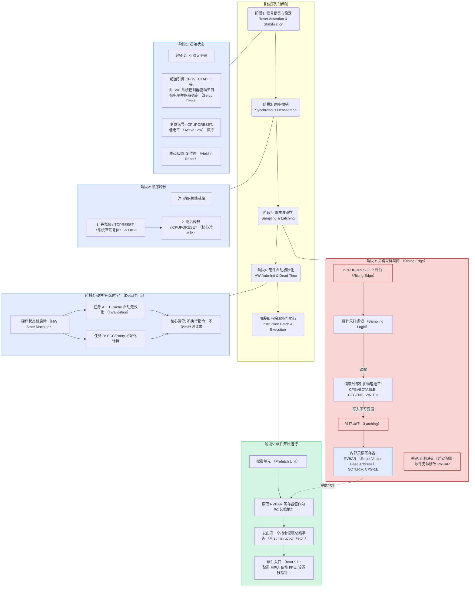

Python AUTOSAR BSW 配置工具 - 详细设计文档
文档版本信息

版本: 1.0
日期: 2025年10月
AUTOSAR版本: 4.4.0 (兼容4.x)
目标Python版本: 3.8+ (兼容3.6+)

目录

系统概述
系统架构设计
数据模型设计
用户界面设计
核心功能模块设计
验证引擎设计
代码生成引擎设计
性能优化方案
安全性设计
测试策略
部署方案
开发计划

1. 系统概述
1.1 项目背景
开发一个基于Python的图形化AUTOSAR BSW配置工具,模拟Vector DaVinci Configurator Pro的核心功能,支持完整的AUTOSAR Classic平台BSW模块(100+)、RTE配置与代码生成。
1.2 核心设计原则

模型驱动: 以内存数据模型为核心,优化大型项目内存使用
实时验证: Debounce机制(0.5秒延迟)防止UI卡顿
用户友好: 向导式工作流、自动化填充、可视化报告

1.3 性能目标

典型项目(<1000参数): 加载时间 < 5秒
大型项目(>10,000参数): 加载时间 < 10秒
测试覆盖率: > 80%
自动保存间隔: 5分钟

2. 系统架构设计
2.1 整体架构
┌─────────────────────────────────────────────────────────┐
│                    Presentation Layer                    │
│  ┌──────────────┐  ┌──────────────┐  ┌──────────────┐  │
│  │  Main Window │  │ Config Panel │  │ Wizard Dialog│  │
│  └──────────────┘  └──────────────┘  └──────────────┘  │
└────────────────────────┬────────────────────────────────┘
                         │
┌────────────────────────┴────────────────────────────────┐
│                   Business Logic Layer                   │
│  ┌──────────────┐  ┌──────────────┐  ┌──────────────┐  │
│  │ Validation   │  │ Code Gen     │  │ Dependency   │  │
│  │ Engine       │  │ Engine       │  │ Manager      │  │
│  └──────────────┘  └──────────────┘  └──────────────┘  │
└────────────────────────┬────────────────────────────────┘
                         │
┌────────────────────────┴────────────────────────────────┐
│                    Data Model Layer                      │
│  ┌──────────────┐  ┌──────────────┐  ┌──────────────┐  │
│  │ ARXML Parser │  │ Model Core   │  │ Serializer   │  │
│  └──────────────┘  └──────────────┘  └──────────────┘  │
└────────────────────────┬────────────────────────────────┘
                         │
┌────────────────────────┴────────────────────────────────┐
│                   Infrastructure Layer                   │
│  ┌──────────────┐  ┌──────────────┐  ┌──────────────┐  │
│  │ File System  │  │ Version Ctrl │  │ Plugin API   │  │
│  └──────────────┘  └──────────────┘  └──────────────┘  │
└─────────────────────────────────────────────────────────┘
2.2 技术栈详细说明
2.2.1 核心技术
python# 技术栈配置
TECH_STACK = {
    "language": "Python 3.8+",
    "gui_framework": "PySide6 (LGPL)",
    "xml_parser": "lxml",
    "template_engine": "Jinja2",
    "testing": "pytest",
    "logging": "logging + rotating file handler",
    "version_control": "GitPython",
    "documentation": "Sphinx + reStructuredText"
}
2.2.2 第三方库依赖
python# requirements.txt
PySide6>=6.5.0
lxml>=4.9.0
Jinja2>=3.1.0
pytest>=7.4.0
pytest-cov>=4.1.0
GitPython>=3.1.0
Sphinx>=7.0.0
dataclasses-json>=0.6.0
jsonschema>=4.19.0
2.3 模块划分
2.3.1 核心模块结构
autosar_configurator/
├── core/                      # 核心层
│   ├── model/                 # 数据模型
│   │   ├── base.py           # 基础类
│   │   ├── bsw/              # BSW模块类
│   │   ├── rte/              # RTE模块类
│   │   └── observers.py      # 观察者模式
│   ├── parser/               # ARXML解析
│   │   ├── arxml_parser.py
│   │   └── schema_validator.py
│   └── serializer/           # 序列化
│       └── arxml_writer.py
├── business/                  # 业务逻辑层
│   ├── validation/           # 验证引擎
│   │   ├── rule_engine.py
│   │   └── rules/            # 验证规则(JSON/YAML)
│   ├── codegen/              # 代码生成
│   │   ├── generator.py
│   │   └── templates/        # Jinja2模板
│   └── dependency/           # 依赖管理
│       └── resolver.py
├── ui/                        # 界面层
│   ├── main_window.py
│   ├── widgets/              # 自定义组件
│   │   ├── tree_view.py
│   │   ├── config_panel.py
│   │   └── wizard.py
│   └── resources/            # UI资源
│       ├── icons/
│       └── qss/              # 样式表
├── infrastructure/           # 基础设施
│   ├── file_manager.py
│   ├── version_control.py
│   └── plugin_system.py
└── utils/                    # 工具类
    ├── logger.py
    └── constants.py

3. 数据模型设计
3.1 基础类设计
3.1.1 ArxmlElement基类
pythonfrom dataclasses import dataclass, field
from typing import Optional, Dict, Any, List
from threading import Lock
from abc import ABC, abstractmethod

@dataclass
class ArxmlElement(ABC):
    """AUTOSAR元素基类"""
    
    # 核心属性
    short_name: str
    uuid: str = field(default_factory=lambda: str(uuid.uuid4()))
    parent: Optional['ArxmlElement'] = None
    
    # 元数据
    description: Optional[str] = None
    category: Optional[str] = None
    admin_data: Dict[str, Any] = field(default_factory=dict)
    
    # OEM扩展属性
    extensions: Dict[str, Any] = field(default_factory=dict)
    
    # 内部状态
    _dirty: bool = field(default=False, init=False, repr=False)
    _lock: Lock = field(default_factory=Lock, init=False, repr=False)
    _observers: List['Observer'] = field(default_factory=list, 
                                         init=False, repr=False)
    
    def __post_init__(self):
        """初始化后验证"""
        self._validate_short_name()
    
    def _validate_short_name(self):
        """验证shortName符合AUTOSAR命名规范"""
        if not self.short_name:
            raise ValueError("shortName cannot be empty")
        if not self.short_name[0].isalpha():
            raise ValueError("shortName must start with letter")
        if not all(c.isalnum() or c == '_' for c in self.short_name):
            raise ValueError("shortName contains invalid characters")
    
    @property
    def is_dirty(self) -> bool:
        """检查是否已修改"""
        return self._dirty
    
    def mark_dirty(self):
        """标记为已修改"""
        with self._lock:
            self._dirty = True
            self._notify_observers('modified', self)
            if self.parent:
                self.parent.mark_dirty()
    
    def mark_clean(self):
        """标记为未修改"""
        with self._lock:
            self._dirty = False
    
    def attach_observer(self, observer: 'Observer'):
        """添加观察者"""
        if observer not in self._observers:
            self._observers.append(observer)
    
    def detach_observer(self, observer: 'Observer'):
        """移除观察者"""
        if observer in self._observers:
            self._observers.remove(observer)
    
    def _notify_observers(self, event: str, data: Any):
        """通知所有观察者"""
        for observer in self._observers:
            observer.update(event, data)
    
    @abstractmethod
    def to_arxml(self) -> str:
        """序列化为ARXML"""
        pass
    
    @classmethod
    @abstractmethod
    def from_arxml(cls, element: 'etree.Element') -> 'ArxmlElement':
        """从ARXML解析"""
        pass
    
    def get_path(self) -> str:
        """获取完整路径"""
        if self.parent is None:
            return f"/{self.short_name}"
        return f"{self.parent.get_path()}/{self.short_name}"
3.1.2 Container容器类
python@dataclass
class Container(ArxmlElement):
    """AUTOSAR容器基类"""
    
    # 子元素
    sub_containers: Dict[str, 'Container'] = field(default_factory=dict)
    parameters: Dict[str, 'Parameter'] = field(default_factory=dict)
    references: Dict[str, 'Reference'] = field(default_factory=dict)
    
    # 多重性约束
    min_multiplicity: int = 0
    max_multiplicity: int = 1  # -1表示无限制
    
    def add_sub_container(self, container: 'Container'):
        """添加子容器"""
        with self._lock:
            if container.short_name in self.sub_containers:
                raise ValueError(f"Container {container.short_name} exists")
            container.parent = self
            self.sub_containers[container.short_name] = container
            self.mark_dirty()
            self._notify_observers('container_added', container)
    
    def remove_sub_container(self, short_name: str):
        """移除子容器"""
        with self._lock:
            if short_name not in self.sub_containers:
                raise ValueError(f"Container {short_name} not found")
            container = self.sub_containers.pop(short_name)
            self.mark_dirty()
            self._notify_observers('container_removed', container)
            return container
    
    def add_parameter(self, param: 'Parameter'):
        """添加参数"""
        with self._lock:
            if param.short_name in self.parameters:
                raise ValueError(f"Parameter {param.short_name} exists")
            param.parent = self
            self.parameters[param.short_name] = param
            self.mark_dirty()
            self._notify_observers('parameter_added', param)
3.2 BSW模块类设计
3.2.1 CAN模块示例
python@dataclass
class CanController(Container):
    """CAN控制器配置"""
    
    # 基本参数
    can_controller_id: int = 0
    can_controller_base_address: int = 0
    
    # 波特率配置
    can_controller_baudrate: int = 500  # kbps
    can_controller_prop_seg: int = 1
    can_controller_seg1: int = 8
    can_controller_seg2: int = 7
    can_controller_sync_jump_width: int = 1
    
    # 激活标志
    can_controller_activation: bool = True
    
    # 引用
    can_cpu_clock_ref: Optional[str] = None
    
    def validate(self) -> List['ValidationError']:
        """验证配置"""
        errors = []
        
        # 验证波特率
        if not (10 <= self.can_controller_baudrate <= 1000):
            errors.append(ValidationError(
                severity='ERROR',
                path=self.get_path(),
                message=f"Baudrate {self.can_controller_baudrate} out of range [10, 1000]"
            ))
        
        # 验证时间段
        total_tq = (1 + self.can_controller_prop_seg + 
                   self.can_controller_seg1 + self.can_controller_seg2)
        if not (8 <= total_tq <= 25):
            errors.append(ValidationError(
                severity='ERROR',
                path=self.get_path(),
                message=f"Total time quanta {total_tq} out of range [8, 25]"
            ))
        
        return errors
    
    def to_arxml(self) -> str:
        """生成ARXML"""
        return f"""
<CAN-CONTROLLER>
    <SHORT-NAME>{self.short_name}</SHORT-NAME>
    <CAN-CONTROLLER-ATTRIBUTES>
        <CAN-CONTROLLER-ID>{self.can_controller_id}</CAN-CONTROLLER-ID>
        <CAN-CONTROLLER-BASE-ADDRESS>{self.can_controller_base_address}</CAN-CONTROLLER-BASE-ADDRESS>
        <CAN-CONTROLLER-BAUDRATE>{self.can_controller_baudrate}</CAN-CONTROLLER-BAUDRATE>
    </CAN-CONTROLLER-ATTRIBUTES>
</CAN-CONTROLLER>
"""

@dataclass
class CanHardwareObject(Container):
    """CAN硬件对象"""
    
    # 对象类型
    can_object_type: str = "TRANSMIT"  # TRANSMIT/RECEIVE
    
    # ID配置
    can_id_type: str = "STANDARD"  # STANDARD/EXTENDED
    can_hw_object_count: int = 1
    
    # 引用
    can_controller_ref: Optional[str] = None
    can_mainfunction_rw_period_ref: Optional[str] = None
    
    # 触发方式
    can_trigger_transmit_en: bool = False
    can_hardware_object_uses_polling: bool = False
3.2.2 COM模块示例
python@dataclass
class ComSignal(Container):
    """COM信号配置"""
    
    # 信号属性
    com_signal_length: int = 8  # bits
    com_signal_type: str = "UINT8"  # UINT8/UINT16/UINT32/BOOLEAN
    com_signal_endianness: str = "BIG_ENDIAN"
    
    # 初始值
    com_signal_init_value: Any = 0
    
    # 超时配置
    com_timeout: Optional[float] = None  # seconds
    com_first_timeout: Optional[float] = None
    
    # 传输属性
    com_transfer_property: str = "TRIGGERED"  # TRIGGERED/PENDING
    
    # 过滤配置
    com_filter_algorithm: Optional[str] = None  # ONE_EVERY_N/MASKED_NEW_DIFFERS_X
    
    # 引用
    com_signal_init_value_ref: Optional[str] = None
    
    def get_byte_length(self) -> int:
        """获取字节长度"""
        return (self.com_signal_length + 7) // 8
    
    def validate(self) -> List['ValidationError']:
        """验证信号配置"""
        errors = []
        
        # 验证信号长度
        if self.com_signal_length <= 0:
            errors.append(ValidationError(
                severity='ERROR',
                path=self.get_path(),
                message="Signal length must be positive"
            ))
        
        # 验证类型与长度匹配
        type_lengths = {
            "UINT8": 8, "UINT16": 16, "UINT32": 32,
            "SINT8": 8, "SINT16": 16, "SINT32": 32,
            "BOOLEAN": 1
        }
        if self.com_signal_type in type_lengths:
            expected = type_lengths[self.com_signal_type]
            if self.com_signal_length != expected:
                errors.append(ValidationError(
                    severity='WARNING',
                    path=self.get_path(),
                    message=f"Signal length {self.com_signal_length} doesn't match type {self.com_signal_type} (expected {expected})"
                ))
        
        return errors
3.3 RTE模块类设计
python@dataclass
class RteSwComponentType(Container):
    """RTE软件组件类型"""
    
    # 端口列表
    ports: List['RtePort'] = field(default_factory=list)
    
    # 内部行为
    internal_behaviors: List['RteInternalBehavior'] = field(default_factory=list)
    
    def add_port(self, port: 'RtePort'):
        """添加端口"""
        port.parent = self
        self.ports.append(port)
        self.mark_dirty()

@dataclass
class RtePort(ArxmlElement):
    """RTE端口"""
    
    # 端口方向
    direction: str = "PROVIDED"  # PROVIDED/REQUIRED
    
    # 端口接口引用
    port_interface_ref: Optional[str] = None
    
    # 数据元素
    data_elements: List['RteDataElement'] = field(default_factory=list)

@dataclass
class RteDataElement(ArxmlElement):
    """RTE数据元素"""
    
    # 数据类型引用
    type_ref: Optional[str] = None
    
    # 初始值
    init_value: Any = None
    
    # 访问方式
    is_queued: bool = False
    queue_length: int = 1

@dataclass
class RteEvent(Container):
    """RTE事件"""
    
    # 事件类型
    event_type: str = "TIMING"  # TIMING/DATA_RECEIVED/OPERATION_INVOKED
    
    # 周期(仅TIMING事件)
    period: Optional[float] = None  # seconds
    
    # 触发的Runnable
    start_on_event_ref: Optional[str] = None
3.4 内存优化策略
3.4.1 延迟加载
pythonclass LazyContainer(Container):
    """支持延迟加载的容器"""
    
    def __init__(self, *args, **kwargs):
        super().__init__(*args, **kwargs)
        self._loaded = False
        self._arxml_element = None
    
    @property
    def sub_containers(self):
        """延迟加载子容器"""
        if not self._loaded:
            self._load_from_arxml()
        return self._sub_containers
    
    def _load_from_arxml(self):
        """从ARXML加载数据"""
        if self._arxml_element is not None:
            # 解析子容器
            self._sub_containers = self._parse_sub_containers(self._arxml_element)
            self._loaded = True
3.4.2 弱引用机制
pythonimport weakref

class ReferenceManager:
    """引用管理器,使用弱引用减少内存占用"""
    
    def __init__(self):
        self._references: Dict[str, weakref.ref] = {}
    
    def register(self, path: str, element: ArxmlElement):
        """注册元素"""
        self._references[path] = weakref.ref(element)
    
    def resolve(self, path: str) -> Optional[ArxmlElement]:
        """解析引用"""
        ref = self._references.get(path)
        if ref is not None:
            element = ref()
            if element is not None:
                return element
            else:
                # 元素已被垃圾回收
                del self._references[path]
        return None

4. 用户界面设计
4.1 主窗口设计
4.1.1 主窗口布局
pythonfrom PySide6.QtWidgets import (QMainWindow, QTreeView, QStackedWidget, 
                               QStatusBar, QToolBar, QDockWidget)
from PySide6.QtCore import Qt

class MainWindow(QMainWindow):
    """主窗口"""
    
    def __init__(self):
        super().__init__()
        self.setWindowTitle("AUTOSAR BSW Configurator")
        self.setGeometry(100, 100, 1400, 900)
        
        self._setup_ui()
        self._setup_toolbar()
        self._setup_statusbar()
        self._setup_shortcuts()
        self._load_settings()
    
    def _setup_ui(self):
        """设置UI布局"""
        # 左侧导航树
        self.tree_dock = QDockWidget("Module Navigator", self)
        self.tree_view = ModuleTreeView()
        self.tree_dock.setWidget(self.tree_view)
        self.addDockWidget(Qt.LeftDockWidgetArea, self.tree_dock)
        
        # 中央配置面板
        self.config_stack = QStackedWidget()
        self.setCentralWidget(self.config_stack)
        
        # 底部日志面板
        self.log_dock = QDockWidget("Messages", self)
        self.log_view = LogView()
        self.log_dock.setWidget(self.log_view)
        self.addDockWidget(Qt.BottomDockWidgetArea, self.log_dock)
        
        # 右侧属性面板
        self.property_dock = QDockWidget("Properties", self)
        self.property_panel = PropertyPanel()
        self.property_dock.setWidget(self.property_panel)
        self.addDockWidget(Qt.RightDockWidgetArea, self.property_dock)
    
    def _setup_toolbar(self):
        """设置工具栏"""
        toolbar = QToolBar("Main Toolbar")
        self.addToolBar(toolbar)
        
        # 文件操作
        toolbar.addAction(QIcon(":/icons/new.png"), "New", self.new_project)
        toolbar.addAction(QIcon(":/icons/open.png"), "Open", self.open_project)
        toolbar.addAction(QIcon(":/icons/save.png"), "Save", self.save_project)
        toolbar.addSeparator()
        
        # 编辑操作
        toolbar.addAction(QIcon(":/icons/undo.png"), "Undo", self.undo)
        toolbar.addAction(QIcon(":/icons/redo.png"), "Redo", self.redo)
        toolbar.addSeparator()
        
        # 验证和生成
        toolbar.addAction(QIcon(":/icons/validate.png"), "Validate", 
                         self.validate_all)
        toolbar.addAction(QIcon(":/icons/generate.png"), "Generate Code", 
                         self.generate_code)
    
    def _setup_statusbar(self):
        """设置状态栏"""
        self.statusbar = QStatusBar()
        self.setStatusBar(self.statusbar)
        
        # 状态标签
        self.status_label = QLabel("Ready")
        self.statusbar.addWidget(self.status_label)
        
        # 错误计数
        self.error_label = QLabel("Errors: 0")
        self.statusbar.addPermanentWidget(self.error_label)
        
        self.warning_label = QLabel("Warnings: 0")
        self.statusbar.addPermanentWidget(self.warning_label)
4.2 模块导航树
4.2.1 树视图实现
pythonclass ModuleTreeView(QTreeView):
    """模块导航树"""
    
    def __init__(self):
        super().__init__()
        self.setHeaderHidden(True)
        self.setDragEnabled(True)
        self.setAcceptDrops(True)
        self.setSelectionMode(QTreeView.ExtendedSelection)
        
        # 模型
        self.model = ModuleTreeModel()
        self.setModel(self.model)
        
        # 搜索框
        self.search_bar = QLineEdit()
        self.search_bar.setPlaceholderText("Search modules...")
        self.search_bar.textChanged.connect(self.filter_tree)
        
        # 上下文菜单
        self.setContextMenuPolicy(Qt.CustomContextMenu)
        self.customContextMenuRequested.connect(self.show_context_menu)
    
    def filter_tree(self, text: str):
        """过滤树节点"""
        if not text:
            # 显示所有
            self.collapseAll()
            return
        
        # 递归搜索匹配节点
        self._filter_recursive(self.model.invisibleRootItem(), text.lower())
    
    def show_context_menu(self, position):
        """显示右键菜单"""
        menu = QMenu()
        
        index = self.indexAt(position)
        if not index.isValid():
            return
        
        item = self.model.itemFromIndex(index)
        
        # 根据节点类型显示不同菜单
        if isinstance(item.data, Container):
            menu.addAction("Add Sub-Container", 
                          lambda: self.add_sub_container(item))
            menu.addAction("Add Parameter", 
                          lambda: self.add_parameter(item))
            menu.addSeparator()
            menu.addAction("Delete", lambda: self.delete_item(item))
        
        menu.exec_(self.mapToGlobal(position))
4.3 配置面板设计
4.3.1 通用配置面板
pythonclass ConfigPanel(QWidget):
    """通用配置面板"""
    
    # 信号
    value_changed = Signal(str, Any)  # (parameter_path, new_value)
    
    def __init__(self, container: Container):
        super().__init__()
        self.container = container
        self._widgets = {}
        self._debounce_timer = QTimer()
        self._debounce_timer.setSingleShot(True)
        self._debounce_timer.timeout.connect(self._validate_delayed)
        
        self._setup_ui()
    
    def _setup_ui(self):
        """设置UI"""
        layout = QVBoxLayout(self)
        
        # 标题
        title = QLabel(f"<h2>{self.container.short_name}</h2>")
        layout.addWidget(title)
        
        # 描述
        if self.container.description:
            desc = QLabel(self.container.description)
            desc.setWordWrap(True)
            layout.addWidget(desc)
        
        # 参数表单
        form_layout = QFormLayout()
        
        for param_name, param in self.container.parameters.items():
            widget = self._create_parameter_widget(param)
            self._widgets[param_name] = widget
            form_layout.addRow(param.short_name + ":", widget)
        
        layout.addLayout(form_layout)
        
        # 子容器表格
        if self.container.sub_containers:
            self.sub_container_table = SubContainerTable(
                self.container.sub_containers
            )
            layout.addWidget(self.sub_container_table)
        
        layout.addStretch()
    
    def _create_parameter_widget(self, param: 'Parameter') -> QWidget:
        """创建参数输入控件"""
        if hasattr(param, 'enum_values'):
            # 枚举类型 - 下拉框
            combo = QComboBox()
            combo.addItems(param.enum_values)
            combo.setCurrentText(str(param.value))
            combo.currentTextChanged.connect(
                lambda v: self._on_value_changed(param, v)
            )
            return combo
        
        elif isinstance(param.value, bool):
            # 布尔类型 - 复选框
            checkbox = QCheckBox()
            checkbox.setChecked(param.value)
            checkbox.stateChanged.connect(
                lambda s: self._on_value_changed(param, s == Qt.Checked)
            )
            return checkbox
        
        elif isinstance(param.value, (int, float)):
            # 数值类型 - 数字输入框
            spinbox = QDoubleSpinBox() if isinstance(param.value, float) else QSpinBox()
            if hasattr(param, 'min_value'):
                spinbox.setMinimum(param.min_value)
            if hasattr(param, 'max_value'):
                spinbox.setMaximum(param.max_value)
            spinbox.setValue(param.value)
            spinbox.valueChanged.connect(
                lambda v: self._on_value_changed(param, v)
            )
            return spinbox
        
        else:
            #RetryMWContinueEditpython        else:
            # 字符串类型 - 文本输入框
            lineedit = QLineEdit()
            lineedit.setText(str(param.value))
            lineedit.textChanged.connect(
                lambda v: self._on_value_changed(param, v)
            )
            
            # 添加自动补全
            if hasattr(param, 'suggestions'):
                completer = QCompleter(param.suggestions)
                lineedit.setCompleter(completer)
            
            return lineedit
    
    def _on_value_changed(self, param: 'Parameter', value: Any):
        """参数值改变处理"""
        # 更新模型
        param.value = value
        param.mark_dirty()
        
        # 发出信号
        self.value_changed.emit(param.get_path(), value)
        
        # 延迟验证(防抖)
        self._debounce_timer.stop()
        self._debounce_timer.start(500)  # 500ms延迟
    
    def _validate_delayed(self):
        """延迟验证"""
        errors = self.container.validate()
        self._display_validation_results(errors)
    
    def _display_validation_results(self, errors: List['ValidationError']):
        """显示验证结果"""
        # 清除旧的错误提示
        for widget in self._widgets.values():
            widget.setStyleSheet("")
        
        # 显示新的错误
        for error in errors:
            param_name = error.path.split('/')[-1]
            if param_name in self._widgets:
                widget = self._widgets[param_name]
                if error.severity == 'ERROR':
                    widget.setStyleSheet("border: 2px solid red;")
                    widget.setToolTip(error.message)
                elif error.severity == 'WARNING':
                    widget.setStyleSheet("border: 2px solid orange;")
                    widget.setToolTip(error.message)
4.3.2 RTE配置面板
pythonclass RteConfigPanel(QWidget):
    """RTE配置专用面板"""
    
    def __init__(self, rte_component: RteSwComponentType):
        super().__init__()
        self.rte_component = rte_component
        self._setup_ui()
    
    def _setup_ui(self):
        """设置UI"""
        layout = QVBoxLayout(self)
        
        # 标签页
        tabs = QTabWidget()
        
        # 端口配置标签页
        self.port_table = RtePortTable(self.rte_component.ports)
        tabs.addTab(self.port_table, "Ports")
        
        # 事件配置标签页
        self.event_table = RteEventTable(self.rte_component.internal_behaviors)
        tabs.addTab(self.event_table, "Events")
        
        # Runnable配置标签页
        self.runnable_table = RteRunnableTable(self.rte_component.internal_behaviors)
        tabs.addTab(self.runnable_table, "Runnables")
        
        # 数据映射可视化
        self.mapping_view = RteMappingView(self.rte_component)
        tabs.addTab(self.mapping_view, "Mapping Visualization")
        
        layout.addWidget(tabs)

class RtePortTable(QTableWidget):
    """RTE端口配置表格"""
    
    def __init__(self, ports: List[RtePort]):
        super().__init__()
        self.ports = ports
        
        # 设置列
        self.setColumnCount(5)
        self.setHorizontalHeaderLabels([
            "Port Name", "Direction", "Interface", "Data Elements", "Actions"
        ])
        
        self._populate_table()
        
        # 添加工具栏
        self._setup_toolbar()
    
    def _populate_table(self):
        """填充表格"""
        self.setRowCount(len(self.ports))
        
        for row, port in enumerate(self.ports):
            # 端口名称
            name_item = QTableWidgetItem(port.short_name)
            self.setItem(row, 0, name_item)
            
            # 方向
            direction_combo = QComboBox()
            direction_combo.addItems(["PROVIDED", "REQUIRED"])
            direction_combo.setCurrentText(port.direction)
            direction_combo.currentTextChanged.connect(
                lambda v, p=port: self._on_direction_changed(p, v)
            )
            self.setCellWidget(row, 1, direction_combo)
            
            # 接口引用
            interface_selector = ReferenceSelector("PortInterface")
            interface_selector.set_reference(port.port_interface_ref)
            interface_selector.reference_changed.connect(
                lambda ref, p=port: self._on_interface_changed(p, ref)
            )
            self.setCellWidget(row, 2, interface_selector)
            
            # 数据元素数量
            data_elem_label = QLabel(str(len(port.data_elements)))
            self.setCellWidget(row, 3, data_elem_label)
            
            # 操作按钮
            action_widget = QWidget()
            action_layout = QHBoxLayout(action_widget)
            action_layout.setContentsMargins(0, 0, 0, 0)
            
            edit_btn = QPushButton("Edit")
            edit_btn.clicked.connect(lambda _, p=port: self._edit_port(p))
            action_layout.addWidget(edit_btn)
            
            delete_btn = QPushButton("Delete")
            delete_btn.clicked.connect(lambda _, p=port: self._delete_port(p))
            action_layout.addWidget(delete_btn)
            
            self.setCellWidget(row, 4, action_widget)
    
    def _setup_toolbar(self):
        """设置工具栏"""
        toolbar = QToolBar()
        
        add_action = toolbar.addAction(QIcon(":/icons/add.png"), "Add Port")
        add_action.triggered.connect(self._add_port)
        
        import_action = toolbar.addAction(QIcon(":/icons/import.png"), 
                                         "Import from ARXML")
        import_action.triggered.connect(self._import_ports)
    
    def _add_port(self):
        """添加新端口"""
        dialog = RtePortWizard(self)
        if dialog.exec_() == QDialog.Accepted:
            new_port = dialog.get_port()
            self.ports.append(new_port)
            self._populate_table()
    
    def _edit_port(self, port: RtePort):
        """编辑端口"""
        dialog = RtePortEditDialog(port, self)
        if dialog.exec_() == QDialog.Accepted:
            self._populate_table()
4.4 向导式工作流
4.4.1 新建项目向导
pythonclass NewProjectWizard(QWizard):
    """新建项目向导"""
    
    def __init__(self):
        super().__init__()
        self.setWindowTitle("New AUTOSAR Project")
        self.setWizardStyle(QWizard.ModernStyle)
        
        # 添加页面
        self.addPage(ProjectInfoPage())
        self.addPage(ModuleSelectionPage())
        self.addPage(EcuConfigPage())
        self.addPage(TemplateSelectionPage())
        self.addPage(SummaryPage())
    
    def get_project_config(self) -> Dict[str, Any]:
        """获取项目配置"""
        return {
            'name': self.field('projectName'),
            'path': self.field('projectPath'),
            'autosar_version': self.field('autosarVersion'),
            'selected_modules': self.field('selectedModules'),
            'ecu_count': self.field('ecuCount'),
            'template': self.field('template'),
            'version_control': self.field('versionControl')
        }

class ProjectInfoPage(QWizardPage):
    """项目信息页"""
    
    def __init__(self):
        super().__init__()
        self.setTitle("Project Information")
        self.setSubTitle("Enter basic information about your AUTOSAR project")
        
        layout = QFormLayout(self)
        
        # 项目名称
        self.name_edit = QLineEdit()
        self.registerField('projectName*', self.name_edit)
        layout.addRow("Project Name:", self.name_edit)
        
        # 项目路径
        path_layout = QHBoxLayout()
        self.path_edit = QLineEdit()
        self.registerField('projectPath*', self.path_edit)
        path_layout.addWidget(self.path_edit)
        
        browse_btn = QPushButton("Browse...")
        browse_btn.clicked.connect(self._browse_path)
        path_layout.addWidget(browse_btn)
        layout.addRow("Project Path:", path_layout)
        
        # AUTOSAR版本
        self.version_combo = QComboBox()
        self.version_combo.addItems(['4.4.0', '4.3.1', '4.2.2', '4.0.3'])
        self.registerField('autosarVersion', self.version_combo, 'currentText')
        layout.addRow("AUTOSAR Version:", self.version_combo)
        
        # 版本控制
        self.git_checkbox = QCheckBox("Initialize Git repository")
        self.git_checkbox.setChecked(True)
        self.registerField('versionControl', self.git_checkbox)
        layout.addRow("", self.git_checkbox)
    
    def _browse_path(self):
        """浏览路径"""
        path = QFileDialog.getExistingDirectory(self, "Select Project Directory")
        if path:
            self.path_edit.setText(path)

class ModuleSelectionPage(QWizardPage):
    """模块选择页"""
    
    def __init__(self):
        super().__init__()
        self.setTitle("Module Selection")
        self.setSubTitle("Select BSW modules to include in your project")
        
        layout = QVBoxLayout(self)
        
        # 预设模板
        template_group = QGroupBox("Quick Templates")
        template_layout = QVBoxLayout(template_group)
        
        self.template_combo = QComboBox()
        self.template_combo.addItems([
            "Empty Project",
            "Basic CAN Communication",
            "Full Communication Stack",
            "Diagnostic Stack",
            "Custom Selection"
        ])
        self.template_combo.currentTextChanged.connect(self._on_template_changed)
        template_layout.addWidget(self.template_combo)
        
        layout.addWidget(template_group)
        
        # 模块列表
        module_group = QGroupBox("Module Selection")
        module_layout = QVBoxLayout(module_group)
        
        # 搜索框
        search_box = QLineEdit()
        search_box.setPlaceholderText("Search modules...")
        search_box.textChanged.connect(self._filter_modules)
        module_layout.addWidget(search_box)
        
        # 模块树
        self.module_tree = QTreeWidget()
        self.module_tree.setHeaderLabels(["Module", "Description"])
        self.module_tree.setColumnWidth(0, 200)
        self._populate_module_tree()
        module_layout.addWidget(self.module_tree)
        
        # 全选/全不选按钮
        button_layout = QHBoxLayout()
        select_all_btn = QPushButton("Select All")
        select_all_btn.clicked.connect(self._select_all)
        button_layout.addWidget(select_all_btn)
        
        deselect_all_btn = QPushButton("Deselect All")
        deselect_all_btn.clicked.connect(self._deselect_all)
        button_layout.addWidget(deselect_all_btn)
        
        module_layout.addLayout(button_layout)
        layout.addWidget(module_group)
        
        # 注册字段
        self.registerField('selectedModules', self, 'selectedModules')
    
    def _populate_module_tree(self):
        """填充模块树"""
        modules = {
            "Communication": [
                ("Can", "CAN Driver"),
                ("CanIf", "CAN Interface"),
                ("CanTp", "CAN Transport Protocol"),
                ("Com", "Communication Manager"),
                ("PduR", "PDU Router"),
                ("CanSM", "CAN State Manager"),
                ("CanNm", "CAN Network Management")
            ],
            "Diagnostic": [
                ("Dcm", "Diagnostic Communication Manager"),
                ("Dem", "Diagnostic Event Manager"),
                ("Fim", "Function Inhibition Manager"),
                ("Dlt", "Diagnostic Log and Trace")
            ],
            "Memory": [
                ("NvM", "Non-Volatile Memory Manager"),
                ("Ea", "EEPROM Abstraction"),
                ("Fee", "Flash EEPROM Emulation"),
                ("Fls", "Flash Driver"),
                ("MemIf", "Memory Interface")
            ],
            "System": [
                ("EcuM", "ECU State Manager"),
                ("BswM", "Basic Software Mode Manager"),
                ("ComM", "Communication Manager"),
                ("Os", "Operating System"),
                ("Det", "Development Error Tracer")
            ],
            "I/O": [
                ("Dio", "Digital I/O"),
                ("Port", "Port Driver"),
                ("Pwm", "PWM Driver"),
                ("Adc", "ADC Driver"),
                ("Gpt", "General Purpose Timer")
            ],
            "RTE": [
                ("Rte", "Runtime Environment")
            ]
        }
        
        for category, module_list in modules.items():
            category_item = QTreeWidgetItem(self.module_tree, [category])
            category_item.setFlags(category_item.flags() | Qt.ItemIsTristate | 
                                   Qt.ItemIsUserCheckable)
            
            for module_name, description in module_list:
                module_item = QTreeWidgetItem(category_item, 
                                             [module_name, description])
                module_item.setFlags(module_item.flags() | Qt.ItemIsUserCheckable)
                module_item.setCheckState(0, Qt.Unchecked)
        
        self.module_tree.expandAll()
    
    def _on_template_changed(self, template: str):
        """模板改变处理"""
        templates = {
            "Empty Project": [],
            "Basic CAN Communication": ["Can", "CanIf", "Com", "PduR"],
            "Full Communication Stack": [
                "Can", "CanIf", "CanTp", "Com", "PduR", 
                "CanSM", "CanNm", "ComM"
            ],
            "Diagnostic Stack": [
                "Dcm", "Dem", "Fim", "Can", "CanIf", "CanTp"
            ]
        }
        
        if template == "Custom Selection":
            return
        
        selected = templates.get(template, [])
        self._update_selection(selected)
    
    def _update_selection(self, modules: List[str]):
        """更新选择"""
        iterator = QTreeWidgetItemIterator(self.module_tree)
        while iterator.value():
            item = iterator.value()
            if item.text(0) in modules:
                item.setCheckState(0, Qt.Checked)
            else:
                item.setCheckState(0, Qt.Unchecked)
            iterator += 1
    
    @property
    def selectedModules(self) -> List[str]:
        """获取选中的模块"""
        selected = []
        iterator = QTreeWidgetItemIterator(
            self.module_tree, 
            QTreeWidgetItemIterator.Checked
        )
        while iterator.value():
            item = iterator.value()
            if item.childCount() == 0:  # 叶子节点
                selected.append(item.text(0))
            iterator += 1
        return selected
4.5 引用选择器
pythonclass ReferenceSelector(QWidget):
    """引用选择器组件"""
    
    reference_changed = Signal(str)  # 引用路径改变信号
    
    def __init__(self, reference_type: str):
        super().__init__()
        self.reference_type = reference_type
        self.current_reference = None
        
        self._setup_ui()
    
    def _setup_ui(self):
        """设置UI"""
        layout = QHBoxLayout(self)
        layout.setContentsMargins(0, 0, 0, 0)
        
        # 引用路径显示
        self.path_edit = QLineEdit()
        self.path_edit.setReadOnly(True)
        self.path_edit.setPlaceholderText(f"Select {self.reference_type}...")
        layout.addWidget(self.path_edit)
        
        # 浏览按钮
        browse_btn = QPushButton("...")
        browse_btn.setMaximumWidth(30)
        browse_btn.clicked.connect(self._browse_reference)
        layout.addWidget(browse_btn)
        
        # 清除按钮
        clear_btn = QPushButton("✕")
        clear_btn.setMaximumWidth(30)
        clear_btn.clicked.connect(self._clear_reference)
        layout.addWidget(clear_btn)
    
    def _browse_reference(self):
        """浏览引用"""
        dialog = ReferenceDialog(self.reference_type, self)
        if dialog.exec_() == QDialog.Accepted:
            ref_path = dialog.get_selected_path()
            self.set_reference(ref_path)
    
    def set_reference(self, path: Optional[str]):
        """设置引用"""
        self.current_reference = path
        self.path_edit.setText(path or "")
        self.reference_changed.emit(path or "")
    
    def _clear_reference(self):
        """清除引用"""
        self.set_reference(None)

class ReferenceDialog(QDialog):
    """引用选择对话框"""
    
    def __init__(self, reference_type: str, parent=None):
        super().__init__(parent)
        self.reference_type = reference_type
        self.selected_path = None
        
        self.setWindowTitle(f"Select {reference_type}")
        self.setModal(True)
        self.resize(600, 400)
        
        self._setup_ui()
        self._load_references()
    
    def _setup_ui(self):
        """设置UI"""
        layout = QVBoxLayout(self)
        
        # 搜索框
        self.search_box = QLineEdit()
        self.search_box.setPlaceholderText("Search...")
        self.search_box.textChanged.connect(self._filter_tree)
        layout.addWidget(self.search_box)
        
        # 引用树
        self.ref_tree = QTreeWidget()
        self.ref_tree.setHeaderLabels(["Name", "Path", "Type"])
        self.ref_tree.itemDoubleClicked.connect(self._on_item_double_clicked)
        layout.addWidget(self.ref_tree)
        
        # 按钮
        button_box = QDialogButtonBox(
            QDialogButtonBox.Ok | QDialogButtonBox.Cancel
        )
        button_box.accepted.connect(self.accept)
        button_box.rejected.connect(self.reject)
        layout.addWidget(button_box)
    
    def _load_references(self):
        """加载可用引用"""
        # 从模型获取所有符合类型的元素
        from core.model.registry import ModelRegistry
        
        registry = ModelRegistry.get_instance()
        elements = registry.find_by_type(self.reference_type)
        
        for element in elements:
            item = QTreeWidgetItem(self.ref_tree)
            item.setText(0, element.short_name)
            item.setText(1, element.get_path())
            item.setText(2, element.__class__.__name__)
            item.setData(0, Qt.UserRole, element.get_path())
    
    def _filter_tree(self, text: str):
        """过滤树"""
        iterator = QTreeWidgetItemIterator(self.ref_tree)
        while iterator.value():
            item = iterator.value()
            visible = text.lower() in item.text(0).lower() or \
                     text.lower() in item.text(1).lower()
            item.setHidden(not visible)
            iterator += 1
    
    def _on_item_double_clicked(self, item, column):
        """双击项目"""
        self.selected_path = item.data(0, Qt.UserRole)
        self.accept()
    
    def accept(self):
        """确认选择"""
        selected_items = self.ref_tree.selectedItems()
        if selected_items:
            self.selected_path = selected_items[0].data(0, Qt.UserRole)
        super().accept()
    
    def get_selected_path(self) -> Optional[str]:
        """获取选中的路径"""
        return self.selected_path

5. 核心功能模块设计
5.1 ARXML解析器
5.1.1 解析器实现
pythonfrom lxml import etree
from typing import Dict, List, Optional
import logging

class ArxmlParser:
    """ARXML解析器"""
    
    def __init__(self):
        self.logger = logging.getLogger(__name__)
        self.namespace_map = {
            'ar': 'http://autosar.org/schema/r4.0'
        }
        self.elements_cache: Dict[str, ArxmlElement] = {}
    
    def parse_file(self, filepath: str) -> 'Project':
        """解析ARXML文件"""
        try:
            # 创建安全的解析器(防止XXE攻击)
            parser = etree.XMLParser(
                resolve_entities=False,
                no_network=True,
                remove_comments=True
            )
            
            tree = etree.parse(filepath, parser)
            root = tree.getroot()
            
            # 验证Schema
            if not self._validate_schema(root):
                raise ValueError("ARXML schema validation failed")
            
            # 解析项目
            project = self._parse_project(root)
            
            self.logger.info(f"Successfully parsed {filepath}")
            return project
            
        except etree.XMLSyntaxError as e:
            self.logger.error(f"XML syntax error: {e}")
            raise
        except Exception as e:
            self.logger.error(f"Failed to parse {filepath}: {e}")
            raise
    
    def _validate_schema(self, root: etree.Element) -> bool:
        """验证ARXML Schema"""
        # 实现Schema验证逻辑
        # 可以加载XSD文件进行验证
        return True
    
    def _parse_project(self, root: etree.Element) -> 'Project':
        """解析项目"""
        project = Project()
        
        # 解析AUTOSAR元素
        ar_packages = root.findall('.//ar:AR-PACKAGE', self.namespace_map)
        
        for package in ar_packages:
            self._parse_package(package, project)
        
        # 解析引用
        self._resolve_references(project)
        
        return project
    
    def _parse_package(self, package_elem: etree.Element, parent):
        """解析包"""
        short_name = package_elem.findtext('ar:SHORT-NAME', 
                                           namespaces=self.namespace_map)
        
        # 创建包对象
        package = ArPackage(short_name=short_name)
        package.parent = parent
        
        # 解析子包
        sub_packages = package_elem.findall('.//ar:AR-PACKAGE', 
                                           self.namespace_map)
        for sub_pkg in sub_packages:
            self._parse_package(sub_pkg, package)
        
        # 解析元素
        elements = package_elem.findall('.//ar:ELEMENTS/*', 
                                       self.namespace_map)
        for elem in elements:
            parsed_elem = self._parse_element(elem)
            if parsed_elem:
                package.add_element(parsed_elem)
        
        # 缓存
        self.elements_cache[package.get_path()] = package
        
        return package
    
    def _parse_element(self, elem: etree.Element) -> Optional[ArxmlElement]:
        """解析元素"""
        tag = etree.QName(elem).localname
        
        # 根据标签类型分发
        parsers = {
            'CAN-CONTROLLER': self._parse_can_controller,
            'CAN-HARDWARE-OBJECT': self._parse_can_hw_object,
            'COM-SIGNAL': self._parse_com_signal,
            'SW-COMPONENT-TYPE': self._parse_swc,
            # ... 更多模块解析器
        }
        
        parser = parsers.get(tag)
        if parser:
            return parser(elem)
        else:
            self.logger.warning(f"Unknown element type: {tag}")
            return None
    
    def _parse_can_controller(self, elem: etree.Element) -> CanController:
        """解析CAN控制器"""
        short_name = elem.findtext('ar:SHORT-NAME', 
                                   namespaces=self.namespace_map)
        
        controller = CanController(short_name=short_name)
        
        # 解析参数
        attrs = elem.find('ar:CAN-CONTROLLER-ATTRIBUTES', self.namespace_map)
        if attrs is not None:
            controller.can_controller_id = int(
                attrs.findtext('ar:CAN-CONTROLLER-ID', 
                              default='0', namespaces=self.namespace_map)
            )
            controller.can_controller_baudrate = int(
                attrs.findtext('ar:CAN-CONTROLLER-BAUDRATE',
                              default='500', namespaces=self.namespace_map)
            )
            # ... 更多参数
        
        return controller
    
    def _resolve_references(self, project: 'Project'):
        """解析引用"""
        # 遍历所有元素,解析引用
        for path, element in self.elements_cache.items():
            if hasattr(element, 'references'):
                for ref_name, ref_path in element.references.items():
                    target = self.elements_cache.get(ref_path)
                    if target:
                        setattr(element, ref_name, target)
                    else:
                        self.logger.warning(
                            f"Unresolved reference: {ref_path} in {path}"
                        )
5.1.2 序列化器实现
pythonclass ArxmlSerializer:
    """ARXML序列化器"""
    
    def __init__(self):
        self.logger = logging.getLogger(__name__)
        self.namespace_map = {
            None: 'http://autosar.org/schema/r4.0',
            'xsi': 'http://www.w3.org/2001/XMLSchema-instance'
        }
    
    def serialize_project(self, project: 'Project', filepath: str):
        """序列化项目到文件"""
        try:
            # 创建根元素
            root = etree.Element(
                'AUTOSAR',
                nsmap=self.namespace_map,
                attrib={
                    '{http://www.w3.org/2001/XMLSchema-instance}schemaLocation':
                    'http://autosar.org/schema/r4.0 AUTOSAR_4-4-0.xsd'
                }
            )
            
            # 序列化项目内容
            self._serialize_packages(project.packages, root)
            
            # 格式化输出
            tree = etree.ElementTree(root)
            tree.write(
                filepath,
                encoding='utf-8',
                xml_declaration=True,
                pretty_print=True
            )
            
            self.logger.info(f"Successfully serialized to {filepath}")
            
        except Exception as e:
            self.logger.error(f"Failed to serialize: {e}")
            raise
    
    def _serialize_packages(self, packages: List['ArPackage'], 
                           parent: etree.Element):
        """序列化包"""
        ar_packages_elem = etree.SubElement(parent, 'AR-PACKAGES')
        
        for package in packages:
            package_elem = etree.SubElement(ar_packages_elem, 'AR-PACKAGE')
            
            # SHORT-NAME
            name_elem = etree.SubElement(package_elem, 'SHORT-NAME')
            name_elem.text = package.short_name
            
            # 子包
            if package.sub_packages:
                self._serialize_packages(package.sub_packages, package_elem)
            
            # 元素
            if package.elements:
                elements_elem = etree.SubElement(package_elem, 'ELEMENTS')
                for element in package.elements:
                    self._serialize_element(element, elements_elem)
    
    def _serialize_element(self, element: ArxmlElement, 
                          parent: etree.Element):
        """序列化元素"""
        if isinstance(element, CanController):
            self._serialize_can_controller(element, parent)
        elif isinstance(element, ComSignal):
            self._serialize_com_signal(element, parent)
        # ... 更多类型
    
    def _serialize_can_controller(self, controller: CanController,
                                  parent: etree.Element):
        """序列化CAN控制器"""
        ctrl_elem = etree.SubElement(parent, 'CAN-CONTROLLER')
        
        # SHORT-NAME
        name_elem = etree.SubElement(ctrl_elem, 'SHORT-NAME')
        name_elem.text = controller.short_name
        
        # 属性
        attrs_elem = etree.SubElement(ctrl_elem, 'CAN-CONTROLLER-ATTRIBUTES')
        
        id_elem = etree.SubElement(attrs_elem, 'CAN-CONTROLLER-ID')
        id_elem.text = str(controller.can_controller_id)
        
        baudrate_elem = etree.SubElement(attrs_elem, 'CAN-CONTROLLER-BAUDRATE')
        baudrate_elem.text = str(controller.can_controller_baudrate)
        
        # ... 更多参数
5.2 项目管理器
pythonclass ProjectManager:
    """项目管理器"""
    
    def __init__(self):
        self.current_project: Optional['Project'] = None
        self.project_path: Optional[str] = None
        self.parser = ArxmlParser()
        self.RetryMWContinueEditpython        self.serializer = ArxmlSerializer()
        self.auto_save_timer = QTimer()
        self.auto_save_timer.timeout.connect(self._auto_save)
        self.auto_save_interval = 5 * 60 * 1000  # 5分钟
        
        # 命令历史(用于Undo/Redo)
        self.command_history = CommandHistory()
        
        # 版本控制
        self.version_control = VersionControlManager()
        
        self.logger = logging.getLogger(__name__)
    
    def new_project(self, config: Dict[str, Any]) -> bool:
        """创建新项目"""
        try:
            # 创建项目目录
            project_path = Path(config['path']) / config['name']
            project_path.mkdir(parents=True, exist_ok=True)
            
            # 创建项目对象
            self.current_project = Project(
                name=config['name'],
                autosar_version=config['autosar_version']
            )
            
            # 根据模板初始化模块
            self._initialize_modules(config['selected_modules'])
            
            # 生成基础ARXML文件
            arxml_path = project_path / f"{config['name']}.arxml"
            self.serializer.serialize_project(self.current_project, str(arxml_path))
            
            # 初始化版本控制
            if config.get('version_control'):
                self.version_control.init_repository(str(project_path))
                self.version_control.initial_commit("Initial project setup")
            
            # 保存项目配置
            self._save_project_config(project_path, config)
            
            # 设置当前路径
            self.project_path = str(project_path)
            
            # 启动自动保存
            self.auto_save_timer.start(self.auto_save_interval)
            
            self.logger.info(f"Created new project: {config['name']}")
            return True
            
        except Exception as e:
            self.logger.error(f"Failed to create project: {e}")
            return False
    
    def open_project(self, project_path: str) -> bool:
        """打开现有项目"""
        try:
            project_dir = Path(project_path)
            
            # 查找ARXML文件
            arxml_files = list(project_dir.glob('*.arxml'))
            if not arxml_files:
                raise FileNotFoundError("No ARXML files found in project")
            
            # 加载项目配置
            config = self._load_project_config(project_dir)
            
            # 解析ARXML文件
            self.current_project = Project()
            
            for arxml_file in arxml_files:
                self.logger.info(f"Loading {arxml_file.name}...")
                parsed = self.parser.parse_file(str(arxml_file))
                self._merge_project(self.current_project, parsed)
            
            # 设置路径
            self.project_path = str(project_dir)
            
            # 加载Git历史(如果有)
            if (project_dir / '.git').exists():
                self.version_control.open_repository(str(project_dir))
            
            # 启动自动保存
            self.auto_save_timer.start(self.auto_save_interval)
            
            # 标记为干净状态
            self.current_project.mark_clean()
            
            self.logger.info(f"Opened project: {project_path}")
            return True
            
        except Exception as e:
            self.logger.error(f"Failed to open project: {e}")
            # 尝试回滚到上个有效状态
            self._rollback_to_last_valid()
            return False
    
    def save_project(self, backup: bool = True) -> bool:
        """保存项目"""
        if not self.current_project or not self.project_path:
            return False
        
        try:
            project_dir = Path(self.project_path)
            arxml_path = project_dir / f"{self.current_project.name}.arxml"
            
            # 原子性保存(使用临时文件)
            temp_path = arxml_path.with_suffix('.arxml.tmp')
            
            # 序列化到临时文件
            self.serializer.serialize_project(
                self.current_project, 
                str(temp_path)
            )
            
            # 备份原文件
            if backup and arxml_path.exists():
                backup_path = arxml_path.with_suffix('.arxml.bak')
                import shutil
                shutil.copy2(arxml_path, backup_path)
            
            # 替换原文件
            temp_path.replace(arxml_path)
            
            # 标记为干净状态
            self.current_project.mark_clean()
            
            # Git提交
            if self.version_control.is_initialized():
                self.version_control.commit(
                    f"Save project: {datetime.now().isoformat()}"
                )
            
            self.logger.info("Project saved successfully")
            return True
            
        except Exception as e:
            self.logger.error(f"Failed to save project: {e}")
            return False
    
    def _auto_save(self):
        """自动保存"""
        if self.current_project and self.current_project.is_dirty:
            self.logger.info("Auto-saving project...")
            self.save_project(backup=True)
    
    def import_arxml(self, filepath: str, merge_strategy: str = 'prompt') -> bool:
        """导入外部ARXML文件
        
        Args:
            filepath: ARXML文件路径
            merge_strategy: 合并策略 - 'overwrite', 'skip', 'prompt'
        """
        try:
            # 解析文件
            imported_project = self.parser.parse_file(filepath)
            
            # 检测冲突
            conflicts = self._detect_conflicts(
                self.current_project, 
                imported_project
            )
            
            if conflicts:
                if merge_strategy == 'prompt':
                    # 显示冲突解决对话框
                    dialog = ConflictResolutionDialog(conflicts)
                    if dialog.exec_() != QDialog.Accepted:
                        return False
                    merge_strategy = dialog.get_strategy()
                
                # 应用合并策略
                self._apply_merge_strategy(
                    self.current_project,
                    imported_project,
                    merge_strategy,
                    conflicts
                )
            else:
                # 无冲突,直接合并
                self._merge_project(self.current_project, imported_project)
            
            self.logger.info(f"Successfully imported {filepath}")
            return True
            
        except Exception as e:
            self.logger.error(f"Failed to import {filepath}: {e}")
            return False
    
    def export_arxml(self, filepath: str, modules: Optional[List[str]] = None) -> bool:
        """导出ARXML文件
        
        Args:
            filepath: 导出路径
            modules: 要导出的模块列表,None表示全部
        """
        try:
            if modules:
                # 创建过滤后的项目副本
                filtered_project = self._filter_project(
                    self.current_project, 
                    modules
                )
                self.serializer.serialize_project(filtered_project, filepath)
            else:
                # 导出完整项目
                self.serializer.serialize_project(self.current_project, filepath)
            
            self.logger.info(f"Successfully exported to {filepath}")
            return True
            
        except Exception as e:
            self.logger.error(f"Failed to export: {e}")
            return False
    
    def _initialize_modules(self, module_names: List[str]):
        """初始化模块"""
        module_factory = ModuleFactory()
        
        for module_name in module_names:
            module = module_factory.create_module(module_name)
            if module:
                self.current_project.add_module(module)
    
    def _merge_project(self, target: 'Project', source: 'Project'):
        """合并项目"""
        # 合并包
        for package in source.packages:
            target.add_package(package)
    
    def _detect_conflicts(self, target: 'Project', 
                         source: 'Project') -> List[Dict[str, Any]]:
        """检测冲突"""
        conflicts = []
        
        # 检查同名元素
        for source_elem in source.get_all_elements():
            target_elem = target.find_element(source_elem.get_path())
            if target_elem:
                conflicts.append({
                    'path': source_elem.get_path(),
                    'target': target_elem,
                    'source': source_elem,
                    'type': 'name_conflict'
                })
        
        return conflicts
    
    def _apply_merge_strategy(self, target: 'Project', source: 'Project',
                              strategy: str, conflicts: List[Dict[str, Any]]):
        """应用合并策略"""
        for conflict in conflicts:
            path = conflict['path']
            
            if strategy == 'overwrite':
                # 覆盖现有元素
                target.replace_element(path, conflict['source'])
            elif strategy == 'skip':
                # 跳过冲突元素
                continue
            # 可以添加更多策略
    
    def _rollback_to_last_valid(self):
        """回滚到上个有效状态"""
        if self.version_control.is_initialized():
            self.version_control.reset_hard('HEAD')
            self.open_project(self.project_path)
    
    def _save_project_config(self, project_path: Path, config: Dict[str, Any]):
        """保存项目配置"""
        config_file = project_path / '.autosar_config.json'
        with open(config_file, 'w') as f:
            json.dump(config, f, indent=2)
    
    def _load_project_config(self, project_path: Path) -> Dict[str, Any]:
        """加载项目配置"""
        config_file = project_path / '.autosar_config.json'
        if config_file.exists():
            with open(config_file, 'r') as f:
                return json.load(f)
        return {}
5.3 命令模式(Undo/Redo)
pythonfrom abc import ABC, abstractmethod

class Command(ABC):
    """命令基类"""
    
    @abstractmethod
    def execute(self):
        """执行命令"""
        pass
    
    @abstractmethod
    def undo(self):
        """撤销命令"""
        pass
    
    @abstractmethod
    def redo(self):
        """重做命令"""
        pass

class AddElementCommand(Command):
    """添加元素命令"""
    
    def __init__(self, parent: Container, element: ArxmlElement):
        self.parent = parent
        self.element = element
        self.executed = False
    
    def execute(self):
        """执行"""
        if not self.executed:
            if isinstance(self.element, Container):
                self.parent.add_sub_container(self.element)
            elif isinstance(self.element, Parameter):
                self.parent.add_parameter(self.element)
            self.executed = True
    
    def undo(self):
        """撤销"""
        if self.executed:
            if isinstance(self.element, Container):
                self.parent.remove_sub_container(self.element.short_name)
            elif isinstance(self.element, Parameter):
                self.parent.remove_parameter(self.element.short_name)
            self.executed = False
    
    def redo(self):
        """重做"""
        self.execute()

class ModifyParameterCommand(Command):
    """修改参数命令"""
    
    def __init__(self, parameter: 'Parameter', old_value: Any, new_value: Any):
        self.parameter = parameter
        self.old_value = old_value
        self.new_value = new_value
    
    def execute(self):
        """执行"""
        self.parameter.value = self.new_value
        self.parameter.mark_dirty()
    
    def undo(self):
        """撤销"""
        self.parameter.value = self.old_value
        self.parameter.mark_dirty()
    
    def redo(self):
        """重做"""
        self.execute()

class DeleteElementCommand(Command):
    """删除元素命令"""
    
    def __init__(self, parent: Container, element: ArxmlElement):
        self.parent = parent
        self.element = element
        self.element_name = element.short_name
        self.dependencies = []  # 保存依赖关系
    
    def execute(self):
        """执行"""
        # 保存依赖关系
        self._save_dependencies()
        
        # 删除元素
        if isinstance(self.element, Container):
            self.parent.remove_sub_container(self.element_name)
        elif isinstance(self.element, Parameter):
            self.parent.remove_parameter(self.element_name)
    
    def undo(self):
        """撤销"""
        # 恢复元素
        if isinstance(self.element, Container):
            self.parent.add_sub_container(self.element)
        elif isinstance(self.element, Parameter):
            self.parent.add_parameter(self.element)
        
        # 恢复依赖
        self._restore_dependencies()
    
    def redo(self):
        """重做"""
        self.execute()
    
    def _save_dependencies(self):
        """保存依赖关系"""
        # 查找引用此元素的所有引用
        from core.model.registry import ModelRegistry
        registry = ModelRegistry.get_instance()
        self.dependencies = registry.find_references_to(self.element.get_path())
    
    def _restore_dependencies(self):
        """恢复依赖关系"""
        for ref_info in self.dependencies:
            ref_info['source'].set_reference(
                ref_info['ref_name'],
                self.element.get_path()
            )

class CommandHistory:
    """命令历史管理"""
    
    def __init__(self, max_size: int = 100):
        self.max_size = max_size
        self.history: List[Command] = []
        self.current_index = -1
    
    def execute(self, command: Command):
        """执行命令"""
        # 执行命令
        command.execute()
        
        # 清除当前位置之后的历史
        self.history = self.history[:self.current_index + 1]
        
        # 添加到历史
        self.history.append(command)
        self.current_index += 1
        
        # 限制历史大小
        if len(self.history) > self.max_size:
            self.history.pop(0)
            self.current_index -= 1
    
    def undo(self) -> bool:
        """撤销"""
        if self.can_undo():
            command = self.history[self.current_index]
            command.undo()
            self.current_index -= 1
            return True
        return False
    
    def redo(self) -> bool:
        """重做"""
        if self.can_redo():
            self.current_index += 1
            command = self.history[self.current_index]
            command.redo()
            return True
        return False
    
    def can_undo(self) -> bool:
        """是否可以撤销"""
        return self.current_index >= 0
    
    def can_redo(self) -> bool:
        """是否可以重做"""
        return self.current_index < len(self.history) - 1
    
    def clear(self):
        """清除历史"""
        self.history.clear()
        self.current_index = -1

6. 验证引擎设计
6.1 验证规则引擎
pythonclass ValidationEngine:
    """验证引擎"""
    
    def __init__(self):
        self.rules: Dict[str, List['ValidationRule']] = {}
        self.logger = logging.getLogger(__name__)
        self._load_rules()
    
    def _load_rules(self):
        """加载验证规则"""
        rules_dir = Path(__file__).parent / 'rules'
        
        for rule_file in rules_dir.glob('*.yaml'):
            self._load_rule_file(rule_file)
    
    def _load_rule_file(self, filepath: Path):
        """加载规则文件"""
        import yaml
        
        with open(filepath, 'r') as f:
            rules_data = yaml.safe_load(f)
        
        module_name = rules_data.get('module')
        
        for rule_data in rules_data.get('rules', []):
            rule = ValidationRule.from_dict(rule_data)
            
            if module_name not in self.rules:
                self.rules[module_name] = []
            
            self.rules[module_name].append(rule)
    
    def validate_element(self, element: ArxmlElement) -> List['ValidationError']:
        """验证元素"""
        errors = []
        
        # 获取适用的规则
        element_type = element.__class__.__name__
        applicable_rules = self.rules.get(element_type, [])
        
        for rule in applicable_rules:
            result = rule.validate(element)
            if result:
                errors.extend(result)
        
        # 如果元素有自定义验证
        if hasattr(element, 'validate'):
            custom_errors = element.validate()
            errors.extend(custom_errors)
        
        return errors
    
    def validate_project(self, project: 'Project') -> List['ValidationError']:
        """验证整个项目"""
        errors = []
        
        # 验证所有元素
        for element in project.get_all_elements():
            element_errors = self.validate_element(element)
            errors.extend(element_errors)
        
        # 一致性检查
        consistency_errors = self._check_consistency(project)
        errors.extend(consistency_errors)
        
        # ASIL安全检查
        if project.has_safety_requirements():
            safety_errors = self._check_safety(project)
            errors.extend(safety_errors)
        
        return errors
    
    def _check_consistency(self, project: 'Project') -> List['ValidationError']:
        """一致性检查"""
        errors = []
        
        # 检查引用完整性
        for element in project.get_all_elements():
            if hasattr(element, 'references'):
                for ref_name, ref_path in element.references.items():
                    target = project.find_element(ref_path)
                    if not target:
                        errors.append(ValidationError(
                            severity='ERROR',
                            path=element.get_path(),
                            message=f"Invalid reference: {ref_path}",
                            rule_id='REF001'
                        ))
        
        # 检查循环引用
        cycle_errors = self._detect_circular_references(project)
        errors.extend(cycle_errors)
        
        # 检查模块间一致性
        # 例如: CanIf的PDU ID必须在Can模块中存在
        module_errors = self._check_module_consistency(project)
        errors.extend(module_errors)
        
        return errors
    
    def _detect_circular_references(self, project: 'Project') -> List['ValidationError']:
        """检测循环引用"""
        errors = []
        visited = set()
        rec_stack = set()
        
        def dfs(element, path):
            visited.add(element.get_path())
            rec_stack.add(element.get_path())
            
            if hasattr(element, 'references'):
                for ref_path in element.references.values():
                    target = project.find_element(ref_path)
                    if target:
                        target_path = target.get_path()
                        if target_path not in visited:
                            dfs(target, path + [target_path])
                        elif target_path in rec_stack:
                            # 发现循环
                            cycle = path + [target_path]
                            errors.append(ValidationError(
                                severity='ERROR',
                                path=element.get_path(),
                                message=f"Circular reference detected: {' -> '.join(cycle)}",
                                rule_id='REF002'
                            ))
            
            rec_stack.remove(element.get_path())
        
        for element in project.get_all_elements():
            if element.get_path() not in visited:
                dfs(element, [element.get_path()])
        
        return errors
    
    def _check_module_consistency(self, project: 'Project') -> List['ValidationError']:
        """检查模块间一致性"""
        errors = []
        
        # 示例: 检查CAN通信栈一致性
        can_module = project.find_module('Can')
        canif_module = project.find_module('CanIf')
        
        if can_module and canif_module:
            # 检查CanIf中的每个PDU是否有对应的CAN对象
            for canif_pdu in canif_module.get_pdus():
                can_id = canif_pdu.can_id
                if not can_module.has_can_id(can_id):
                    errors.append(ValidationError(
                        severity='ERROR',
                        path=canif_pdu.get_path(),
                        message=f"CAN ID {can_id} not configured in Can module",
                        rule_id='CONSISTENCY001'
                    ))
        
        return errors
    
    def _check_safety(self, project: 'Project') -> List['ValidationError']:
        """ASIL安全检查"""
        errors = []
        
        # 检查ASIL等级一致性
        for element in project.get_all_elements():
            if hasattr(element, 'asil_level'):
                # 检查依赖的元素ASIL等级不能低于当前元素
                if hasattr(element, 'references'):
                    for ref_path in element.references.values():
                        target = project.find_element(ref_path)
                        if target and hasattr(target, 'asil_level'):
                            if self._asil_compare(element.asil_level, 
                                                 target.asil_level) > 0:
                                errors.append(ValidationError(
                                    severity='ERROR',
                                    path=element.get_path(),
                                    message=f"ASIL violation: {element.asil_level} element references {target.asil_level} element",
                                    rule_id='ASIL001'
                                ))
        
        return errors
    
    def _asil_compare(self, level1: str, level2: str) -> int:
        """比较ASIL等级"""
        levels = {'QM': 0, 'ASIL_A': 1, 'ASIL_B': 2, 'ASIL_C': 3, 'ASIL_D': 4}
        return levels.get(level1, 0) - levels.get(level2, 0)

@dataclass
class ValidationError:
    """验证错误"""
    severity: str  # ERROR, WARNING, INFO
    path: str
    message: str
    rule_id: str
    line_number: Optional[int] = None
    column_number: Optional[int] = None
    suggested_fix: Optional[str] = None

class ValidationRule:
    """验证规则"""
    
    def __init__(self, rule_id: str, name: str, description: str,
                 severity: str, condition: Callable):
        self.rule_id = rule_id
        self.name = name
        self.description = description
        self.severity = severity
        self.condition = condition
    
    def validate(self, element: ArxmlElement) -> List[ValidationError]:
        """执行验证"""
        try:
            result = self.condition(element)
            if result is False:
                return [ValidationError(
                    severity=self.severity,
                    path=element.get_path(),
                    message=self.description,
                    rule_id=self.rule_id
                )]
            elif isinstance(result, str):
                # 自定义错误消息
                return [ValidationError(
                    severity=self.severity,
                    path=element.get_path(),
                    message=result,
                    rule_id=self.rule_id
                )]
        except Exception as e:
            # 规则执行失败
            return [ValidationError(
                severity='WARNING',
                path=element.get_path(),
                message=f"Rule {self.rule_id} execution failed: {e}",
                rule_id='RULE_ERROR'
            )]
        
        return []
    
    @classmethod
    def from_dict(cls, data: Dict[str, Any]) -> 'ValidationRule':
        """从字典创建规则"""
        # 解析条件表达式
        condition_str = data['condition']
        condition = cls._parse_condition(condition_str)
        
        return cls(
            rule_id=data['id'],
            name=data['name'],
            description=data['description'],
            severity=data.get('severity', 'ERROR'),
            condition=condition
        )
    
    @staticmethod
    def _parse_condition(condition_str: str) -> Callable:
        """解析条件表达式"""
        # 简单的表达式解析器
        # 支持: element.attribute == value, element.attribute > value等
        
        def condition(element):
            # 创建安全的执行环境
            safe_dict = {
                'element': element,
                '__builtins__': {}
            }
            try:
                return eval(condition_str, safe_dict)
            except:
                return True
        
        return condition
6.2 验证规则示例(YAML格式)
yaml# rules/can_rules.yaml
module: CanController

rules:
  - id: CAN001
    name: BaudrateRange
    description: CAN baudrate must be between 10 and 1000 kbps
    severity: ERROR
    condition: 10 <= element.can_controller_baudrate <= 1000
  
  - id: CAN002
    name: TimeQuantaRange
    description: Total time quanta must be between 8 and 25
    severity: ERROR
    condition: |
      8 <= (1 + element.can_controller_prop_seg + 
            element.can_controller_seg1 + 
            element.can_controller_seg2) <= 25
  
  - id: CAN003
    name: SyncJumpWidth
    description: Sync jump width must not exceed segment 2
    severity: WARNING
    condition: element.can_controller_sync_jump_width <= element.can_controller_seg2
  
  - id: CAN004
    name: UniqueControllerId
    description: CAN controller ID must be unique within project
    severity: ERROR
    condition: element._check_unique_id()
6.3 异步验证
pythonfrom PySide6.QtCore import QThread, Signal

class ValidationWorker(QThread):
    """异步验证工作线程"""
    
    # 信号
    validation_started = Signal()
    validation_progress = Signal(int, int)  # (current, total)
    validation_completed = Signal(list)  # List[ValidationError]
    validation_error = Signal(str)
    
    def __init__(self, project: 'Project', engine: ValidationEngine):
        super().__init__()
        self.project = project
        self.engine = engine
    
    def run(self):
        """运行验证"""
        try:
            self.validation_started.emit()
            
            errors = []
            elements = list(self.project.get_all_elements())
            total = len(elements)
            
            for i, element in enumerate(elements):
                # 验证元素
                element_errors = self.engine.validate_element(element)
                errors.extend(element_errors)
                
                # 发送进度
                self.validation_progress.emit(i + 1, total)
                
                # 检查是否被中断
                if self.isInterruptionRequested():
                    return
            
            # 一致性检查
            consistency_errors = self.engine._check_consistency(self.project)
            errors.extend(consistency_errors)
            
            # 发送结果
            self.validation_completed.emit(errors)
            
        except Exception as e:
            self.validation_error.emit(str(e))

7. 代码生成引擎设计
7.1 代码生成器
pythonfrom jinja2 import Environment, FileSystemLoader, select_autoescape

class CodeGenerator:
    """代码生成器"""
    
    def __init__(self):
        # 设置Jinja2环境
        template_dir = Path(__file__).parent / 'templates'
        self.env = Environment(
            loader=FileSystemLoader(str(template_dir)),
            autoescape=select_autoescape(['c', 'h']),
            trim_blocks=True,
            lstrip_blocks=True
        )
        
        # 添加自定义过滤器
        self.env.filters['to_upper_snake'] = self._to_upper_snake_case
        self.env.filters['to_camel'] = self._to_camel_case
        
        self.logger = logging.getLogger(__name__)
    
    def generate_bsw_code(self, project: 'Project', output_dir: str):
        """生成BSW代码"""
        output_path = Path(output_dir)
        output_path.mkdir(parents=True, exist_ok=True)
        
        # 生成各模块代码
        for module in project.get_modules():
            self._generate_module_code(module, output_path)
        
        # 生成配置汇总文件
        self._generate_config_header(project, output_path)
        
        self.logger.info(f"Code generated to {output_dir}")
    
    def _generate_module_code(self, module: 'BswModule', output_dir: Path):
        """生成模块代码"""
        module_name = module.__class__.__name__
        
        # 生成头文件
        header_template = self.env.get_template(f'{module_name}_Cfg.h.jinja2')
        header_content = header_template.render(module=module)
        
        header_file = output_dir / f'{module_name}_Cfg.h'
        with open(header_file, 'w') as f:
            f.write(header_content)

        # 生成源文件
        source_template = self.env.get_template(f'{module_name}_Cfg.c.jinja2')
        source_content = source_template.render(module=module)

        source_file = output_dir / f'{module_name}_Cfg.c'
        with open(source_file, 'w') as f:
            f.write(source_content)

        self.logger.info(f"Generated code for {module_name}")

    def _generate_config_header(self, project: 'Project', output_dir: Path):
        """生成配置汇总头文件"""
        template = self.env.get_template('Config_Summary.h.jinja2')
        content = template.render(project=project)

        header_file = output_dir / 'Config_Summary.h'
        with open(header_file, 'w') as f:
            f.write(content)

    def generate_rte_code(self, project: 'Project', output_dir: str):
        """生成RTE代码"""
        output_path = Path(output_dir) / 'Rte'
        output_path.mkdir(parents=True, exist_ok=True)

        # 为每个SWC生成RTE接口
        for swc in project.get_software_components():
            self._generate_rte_interface(swc, output_path)

        # 生成RTE主文件
        self._generate_rte_main(project, output_path)

        self.logger.info(f"RTE code generated to {output_dir}")

    def _generate_rte_interface(self, swc: 'RteSwComponentType', output_dir: Path):
        """生成RTE接口代码"""
        swc_name = swc.short_name

        # 生成Rte_{SWC}.h
        template = self.env.get_template('Rte_Component.h.jinja2')
        content = template.render(swc=swc)

        header_file = output_dir / f'Rte_{swc_name}.h'
        with open(header_file, 'w') as f:
            f.write(content)

        # 生成Rte_{SWC}.c
        template = self.env.get_template('Rte_Component.c.jinja2')
        content = template.render(swc=swc)

        source_file = output_dir / f'Rte_{swc_name}.c'
        with open(source_file, 'w') as f:
            f.write(content)

    def _generate_rte_main(self, project: 'Project', output_dir: Path):
        """生成RTE主文件"""
        # Rte.h
        template = self.env.get_template('Rte.h.jinja2')
        content = template.render(project=project)

        header_file = output_dir / 'Rte.h'
        with open(header_file, 'w') as f:
            f.write(content)

        # Rte.c
        template = self.env.get_template('Rte.c.jinja2')
        content = template.render(project=project)

        source_file = output_dir / 'Rte.c'
        with open(source_file, 'w') as f:
            f.write(content)

    @staticmethod
    def _to_upper_snake_case(s: str) -> str:
        """转换为大写下划线格式"""
        import re
        s = re.sub('(.)([A-Z][a-z]+)', r'\1_\2', s)
        s = re.sub('([a-z0-9])([A-Z])', r'\1_\2', s)
        return s.upper()

    @staticmethod
    def _to_camel_case(s: str) -> str:
        """转换为驼峰格式"""
        components = s.split('_')
        return components[0] + ''.join(x.title() for x in components[1:])

7.2 代码模板示例
7.2.1 CAN配置头文件模板
jinja2{# templates/Can_Cfg.h.jinja2 #}
/**
 * @file Can_Cfg.h
 * @brief CAN Driver Configuration Header
 * @generated by AUTOSAR BSW Configurator
 * @date {{ now() }}
 */

#ifndef CAN_CFG_H
#define CAN_CFG_H

#ifdef __cplusplus
extern "C" {
#endif

/*==================================================================================================
*                                        INCLUDE FILES
==================================================================================================*/
#include "Can_GeneralTypes.h"

/*==================================================================================================
*                                      DEFINES AND MACROS
==================================================================================================*/
/* Development Error Detection */
#define CAN_DEV_ERROR_DETECT        {{ 'STD_ON' if module.dev_error_detect else 'STD_OFF' }}

/* Version Info API */
#define CAN_VERSION_INFO_API        {{ 'STD_ON' if module.version_info_api else 'STD_OFF' }}

/* Number of CAN Controllers */
#define CAN_CONTROLLER_COUNT        {{ module.controllers|length }}U

/* CAN Controller IDs */

#define CanConf_CanController_{{ controller.short_name }}    {{ controller.can_controller_id }}U


/* Hardware Object Handles */

#define CanConf_CanHardwareObject_{{ hoh.short_name }}    {{ loop.index0 }}U


/*==================================================================================================
*                                             ENUMS
==================================================================================================*/

/*==================================================================================================
*                                STRUCTURES AND OTHER TYPEDEFS
==================================================================================================*/

/*==================================================================================================
*                                GLOBAL VARIABLE DECLARATIONS
==================================================================================================*/
extern const Can_ConfigType Can_Config;

/*==================================================================================================
*                                    FUNCTION PROTOTYPES
==================================================================================================*/

#ifdef __cplusplus
}
#endif

#endif /* CAN_CFG_H */
7.2.2 CAN配置源文件模板
jinja2{# templates/Can_Cfg.c.jinja2 #}
/**
 * @file Can_Cfg.c
 * @brief CAN Driver Configuration Source
 * @generated by AUTOSAR BSW Configurator
 * @date {{ now() }}
 */

/*==================================================================================================
*                                        INCLUDE FILES
==================================================================================================*/
#include "Can_Cfg.h"
#include "Can.h"

/*==================================================================================================
*                          LOCAL TYPEDEFS (STRUCTURES, UNIONS, ENUMS)
==================================================================================================*/

/*==================================================================================================
*                                       LOCAL MACROS
==================================================================================================*/

/*==================================================================================================
*                                      LOCAL CONSTANTS
==================================================================================================*/

/*==================================================================================================
*                                      LOCAL VARIABLES
==================================================================================================*/

/*==================================================================================================
*                                      GLOBAL CONSTANTS
==================================================================================================*/

/* CAN Controller Configurations */

static const Can_ControllerConfigType Can_ControllerConfig_{{ controller.short_name }} = {
    .CanControllerId = {{ controller.can_controller_id }}U,
    .CanControllerBaseAddress = {{ controller.can_controller_base_address }}U,
    .CanControllerBaudRate = {{ controller.can_controller_baudrate }}U,
    .CanControllerPropSeg = {{ controller.can_controller_prop_seg }}U,
    .CanControllerSeg1 = {{ controller.can_controller_seg1 }}U,
    .CanControllerSeg2 = {{ controller.can_controller_seg2 }}U,
    .CanControllerSyncJumpWidth = {{ controller.can_controller_sync_jump_width }}U,
    .CanControllerActivation = {{ 'TRUE' if controller.can_controller_activation else 'FALSE' }}
};


/* Hardware Object Configurations */

static const Can_HardwareObjectConfigType Can_HohConfig_{{ hoh.short_name }} = {
    .CanObjectType = CAN_OBJECT_TYPE_{{ hoh.can_object_type }},
    .CanIdType = CAN_ID_TYPE_{{ hoh.can_id_type }},
    .CanHwObjectCount = {{ hoh.can_hw_object_count }}U,
    .CanControllerRef = {{ hoh.can_controller_ref }},
    .CanTriggerTransmitEnable = {{ 'TRUE' if hoh.can_trigger_transmit_en else 'FALSE' }},
    .CanHardwareObjectUsesPolling = {{ 'TRUE' if hoh.can_hardware_object_uses_polling else 'FALSE' }}
};


/* Main CAN Configuration */
const Can_ConfigType Can_Config = {
    .CanControllers = {
        
        &Can_ControllerConfig_{{ controller.short_name }}{{ ',' if not loop.last else '' }}
        
    },
    .CanHardwareObjects = {
        
        &Can_HohConfig_{{ hoh.short_name }}{{ ',' if not loop.last else '' }}
        
    },
    .CanControllerCount = CAN_CONTROLLER_COUNT,
    .CanHardwareObjectCount = {{ module.hardware_objects|length }}U
};

/*==================================================================================================
*                                      GLOBAL VARIABLES
==================================================================================================*/

/*==================================================================================================
*                                   LOCAL FUNCTION PROTOTYPES
==================================================================================================*/

/*==================================================================================================
*                                       LOCAL FUNCTIONS
==================================================================================================*/

/*==================================================================================================
*                                       GLOBAL FUNCTIONS
==================================================================================================*/
7.2.3 RTE组件头文件模板
jinja2{# templates/Rte_Component.h.jinja2 #}
/**
 * @file Rte_{{ swc.short_name }}.h
 * @brief RTE Interface for {{ swc.short_name }}
 * @generated by AUTOSAR BSW Configurator
 */

#ifndef RTE_{{ swc.short_name|upper }}_H
#define RTE_{{ swc.short_name|upper }}_H

#ifdef __cplusplus
extern "C" {
#endif

/*==================================================================================================
*                                        INCLUDE FILES
==================================================================================================*/
#include "Rte_Type.h"

/*==================================================================================================
*                                         PORT APIS
==================================================================================================*/



/* Provided Port: {{ port.short_name }} */

Std_ReturnType Rte_Write_{{ swc.short_name }}_{{ port.short_name }}_{{ data_elem.short_name }}(
    {{ data_elem.type_ref }} data
);



/* Required Port: {{ port.short_name }} */

Std_ReturnType Rte_Read_{{ swc.short_name }}_{{ port.short_name }}_{{ data_elem.short_name }}(
    {{ data_elem.type_ref }}* data
);




/*==================================================================================================
*                                    RUNNABLE PROTOTYPES
==================================================================================================*/


void {{ swc.short_name }}_{{ runnable.short_name }}(void);



#ifdef __cplusplus
}
#endif

#endif /* RTE_{{ swc.short_name|upper }}_H */

7.3 代码生成优化
pythonclass OptimizedCodeGenerator(CodeGenerator):
    """优化的代码生成器"""

    def __init__(self):
        super().__init__()
        self.generated_files_cache: Dict[str, str] = {}

    def generate_incremental(self, project: 'Project', output_dir: str,
                            changed_modules: List[str]):
        """增量代码生成"""
        output_path = Path(output_dir)

        # 只重新生成改变的模块
        for module_name in changed_modules:
            module = project.find_module(module_name)
            if module:
                self._generate_module_code(module, output_path)

        self.logger.info(f"Incremental generation completed for {len(changed_modules)} modules")

    def generate_with_diff(self, project: 'Project', output_dir: str) -> Dict[str, str]:
        """生成代码并返回差异"""
        diffs = {}
        output_path = Path(output_dir)

        for module in project.get_modules():
            module_name = module.__class__.__name__

            # 生成新代码
            new_code = self._generate_module_header(module)

            # 读取旧代码
            header_file = output_path / f'{module_name}_Cfg.h'
            if header_file.exists():
                with open(header_file, 'r') as f:
                    old_code = f.read()

                # 计算差异
                if old_code != new_code:
                    diff = self._compute_diff(old_code, new_code)
                    diffs[str(header_file)] = diff

            # 写入新代码
            with open(header_file, 'w') as f:
                f.write(new_code)

        return diffs

    def _compute_diff(self, old: str, new: str) -> str:
        """计算差异"""
        import difflib

        diff = difflib.unified_diff(
            old.splitlines(keepends=True),
            new.splitlines(keepends=True),
            fromfile='old',
            tofile='new'
        )

        return ''.join(diff)

    def _generate_module_header(self, module: 'BswModule') -> str:
        """生成模块头文件内容"""
        module_name = module.__class__.__name__
        template = self.env.get_template(f'{module_name}_Cfg.h.jinja2')
        return template.render(module=module)

8. 性能优化方案
8.1 内存管理策略
pythonclass MemoryManager:
    """内存管理器"""

    def __init__(self):
        self.object_pool: Dict[type, List[Any]] = {}
        self.weak_refs: weakref.WeakValueDictionary = weakref.WeakValueDictionary()
        self.cache_limit = 1000
        self.logger = logging.getLogger(__name__)

    def get_object(self, obj_type: type, *args, **kwargs):
        """从对象池获取对象"""
        pool = self.object_pool.get(obj_type, [])

        if pool:
            obj = pool.pop()
            # 重新初始化
            obj.__init__(*args, **kwargs)
            return obj
        else:
            # 创建新对象
            return obj_type(*args, **kwargs)

    def return_object(self, obj):
        """归还对象到池"""
        obj_type = type(obj)

        if obj_type not in self.object_pool:
            self.object_pool[obj_type] = []

        pool = self.object_pool[obj_type]
        if len(pool) < self.cache_limit:
            pool.append(obj)

    def clear_pool(self):
        """清空对象池"""
        self.object_pool.clear()
        self.logger.info("Object pool cleared")

    def get_memory_usage(self) -> Dict[str, int]:
        """获取内存使用情况"""
        import sys

        usage = {}
        for obj_type, pool in self.object_pool.items():
            size = sum(sys.getsizeof(obj) for obj in pool)
            usage[obj_type.__name__] = size

        return usage

8.2 懒加载实现
pythonclass LazyLoadingProxy:
    """懒加载代理"""

    def __init__(self, loader_func: Callable, *args, **kwargs):
        self._loader_func = loader_func
        self._loader_args = args
        self._loader_kwargs = kwargs
        self._loaded_object = None
        self._is_loaded = False

    def __getattr__(self, name):
        """延迟加载属性"""
        if not self._is_loaded:
            self._load()
        return getattr(self._loaded_object, name)

    def _load(self):
        """执行加载"""
        if not self._is_loaded:
            self._loaded_object = self._loader_func(
                *self._loader_args,
                **self._loader_kwargs
            )
            self._is_loaded = True

    def is_loaded(self) -> bool:
        """检查是否已加载"""
        return self._is_loaded

    def unload(self):
        """卸载对象"""
        self._loaded_object = None
        self._is_loaded = False

8.3 缓存策略
pythonfrom functools import lru_cache
from threading import RLock

class CacheManager:
    """缓存管理器"""

    def __init__(self, max_size: int = 1000):
        self.max_size = max_size
        self.cache: Dict[str, Any] = {}
        self.access_count: Dict[str, int] = {}
        self.lock = RLock()
        self.logger = logging.getLogger(__name__)

    def get(self, key: str) -> Optional[Any]:
        """获取缓存"""
        with self.lock:
            if key in self.cache:
                self.access_count[key] = self.access_count.get(key, 0) + 1
                return self.cache[key]
            return None

    def put(self, key: str, value: Any):
        """放入缓存"""
        with self.lock:
            if len(self.cache) >= self.max_size:
                self._evict_lfu()

            self.cache[key] = value
            self.access_count[key] = 0

    def _evict_lfu(self):
        """LFU淘汰策略"""
        # 找到访问次数最少的键
        min_key = min(self.access_count, key=self.access_count.get)
        del self.cache[min_key]
        del self.access_count[min_key]
        self.logger.debug(f"Evicted cache key: {min_key}")

    def clear(self):
        """清空缓存"""
        with self.lock:
            self.cache.clear()
            self.access_count.clear()

    def get_stats(self) -> Dict[str, Any]:
        """获取缓存统计"""
        with self.lock:
            return {
                'size': len(self.cache),
                'max_size': self.max_size,
                'total_accesses': sum(self.access_count.values()),
                'most_accessed': max(self.access_count, key=self.access_count.get) if self.access_count else None
            }

8.4 多线程优化
pythonfrom concurrent.futures import ThreadPoolExecutor, as_completed
from PySide6.QtCore import QThreadPool, QRunnable, Signal, QObject

class WorkerSignals(QObject):
    """工作线程信号"""
    finished = Signal(object)
    error = Signal(str)
    progress = Signal(int)

class ParseWorker(QRunnable):
    """ARXML解析工作线程"""

    def __init__(self, filepath: str, parser: ArxmlParser):
        super().__init__()
        self.filepath = filepath
        self.parser = parser
        self.signals = WorkerSignals()

    def run(self):
        """执行解析"""
        try:
            result = self.parser.parse_file(self.filepath)
            self.signals.finished.emit(result)
        except Exception as e:
            self.signals.error.emit(str(e))

class ParallelProjectLoader:
    """并行项目加载器"""

    def __init__(self, max_workers: int = 4):
        self.max_workers = max_workers
        self.thread_pool = QThreadPool()
        self.thread_pool.setMaxThreadCount(max_workers)
        self.logger = logging.getLogger(__name__)

    def load_project_parallel(self, arxml_files: List[str],
                             parser: ArxmlParser) -> 'Project':
        """并行加载项目"""
        project = Project()
        workers = []

        for filepath in arxml_files:
            worker = ParseWorker(filepath, parser)
            worker.signals.finished.connect(
                lambda result: self._merge_result(project, result)
            )
            worker.signals.error.connect(
                lambda error: self.logger.error(f"Parse error: {error}")
            )
            workers.append(worker)
            self.thread_pool.start(worker)

        # 等待所有任务完成
        self.thread_pool.waitForDone()

        return project

    def _merge_result(self, project: 'Project', parsed: 'Project'):
        """合并解析结果"""
        for package in parsed.packages:
            project.add_package(package)

9. 安全性设计
9.1 输入验证
pythonclass InputValidator:
    """输入验证器"""

    @staticmethod
    def validate_short_name(name: str) -> bool:
        """验证shortName"""
        if not name:
            return False
        if not name[0].isalpha():
            return False
        if not all(c.isalnum() or c == '_' for c in name):
            return False
        if len(name) > 128:
            return False
        return True

    @staticmethod
    def validate_path(path: str) -> bool:
        """验证文件路径"""
        import os

        # 防止路径遍历攻击
        normalized = os.path.normpath(path)
        if '..' in normalized:
            return False

        # 检查路径长度
        if len(path) > 4096:
            return False

        return True

    @staticmethod
    def sanitize_xml_content(content: str) -> str:
        """清理XML内容"""
        import html

        # 转义特殊字符
        sanitized = html.escape(content)

        # 移除控制字符
        sanitized = ''.join(c for c in sanitized if c.isprintable() or c.isspace())

        return sanitized

    @staticmethod
    def validate_numeric_range(value: Any, min_val: float, max_val: float) -> bool:
        """验证数值范围"""
        try:
            num_value = float(value)
            return min_val <= num_value <= max_val
        except (ValueError, TypeError):
            return False

9.2 访问控制
pythonclass AccessController:
    """访问控制器"""

    def __init__(self):
        self.permissions: Dict[str, Set[str]] = {
            'admin': {'read', 'write', 'delete', 'configure'},
            'engineer': {'read', 'write', 'configure'},
            'viewer': {'read'}
        }
        self.current_role = 'engineer'

    def has_permission(self, operation: str) -> bool:
        """检查权限"""
        return operation in self.permissions.get(self.current_role, set())

    def set_role(self, role: str):
        """设置角色"""
        if role in self.permissions:
            self.current_role = role

    def check_file_access(self, filepath: str, mode: str) -> bool:
        """检查文件访问权限"""
        if mode == 'r' and self.has_permission('read'):
            return True
        elif mode in ('w', 'a') and self.has_permission('write'):
            return True
        return False

9.3 数据加密
pythonfrom cryptography.fernet import Fernet
import base64
import hashlib

class DataEncryptor:
    """数据加密器"""

    def __init__(self, password: Optional[str] = None):
        if password:
            key = self._derive_key(password)
            self.cipher = Fernet(key)
        else:
            self.cipher = None

    @staticmethod
    def _derive_key(password: str) -> bytes:
        """从密码派生密钥"""
        kdf = hashlib.pbkdf2_hmac(
            'sha256',
            password.encode(),
            b'autosar_salt',  # 应使用随机salt
            100000
        )
        return base64.urlsafe_b64encode(kdf)

    def encrypt_file(self, input_path: str, output_path: str):
        """加密文件"""
        if not self.cipher:
            raise ValueError("Encryption not enabled")

        with open(input_path, 'rb') as f:
            data = f.read()

        encrypted = self.cipher.encrypt(data)

        with open(output_path, 'wb') as f:
            f.write(encrypted)

    def decrypt_file(self, input_path: str, output_path: str):
        """解密文件"""
        if not self.cipher:
            raise ValueError("Encryption not enabled")

        with open(input_path, 'rb') as f:
            encrypted = f.read()

        decrypted = self.cipher.decrypt(encrypted)

        with open(output_path, 'wb') as f:
            f.write(decrypted)

    def encrypt_string(self, plaintext: str) -> str:
        """加密字符串"""
        if not self.cipher:
            return plaintext

        encrypted = self.cipher.encrypt(plaintext.encode())
        return base64.urlsafe_b64encode(encrypted).decode()

    def decrypt_string(self, ciphertext: str) -> str:
        """解密字符串"""
        if not self.cipher:
            return ciphertext

        encrypted = base64.urlsafe_b64decode(ciphertext.encode())
        decrypted = self.cipher.decrypt(encrypted)
        return decrypted.decode()

10. 测试策略
10.1 单元测试框架
pythonimport pytest
from unittest.mock import Mock, MagicMock, patch

class TestCanController:
    """CAN控制器测试"""

    def test_create_controller(self):
        """测试创建控制器"""
        controller = CanController(
            short_name="CanController_0",
            can_controller_id=0,
            can_controller_baudrate=500
        )

        assert controller.short_name == "CanController_0"
        assert controller.can_controller_id == 0
        assert controller.can_controller_baudrate == 500

    def test_validate_baudrate_range(self):
        """测试波特率范围验证"""
        controller = CanController(
            short_name="CanController_0",
            can_controller_baudrate=5  # 无效值
        )

        errors = controller.validate()
        assert len(errors) > 0
        assert any('baudrate' in e.message.lower() for e in errors)

    def test_validate_time_quanta(self):
        """测试时间段验证"""
        controller = CanController(
            short_name="CanController_0",
            can_controller_prop_seg=1,
            can_controller_seg1=8,
            can_controller_seg2=7
        )

        errors = controller.validate()
        # 总时间段 = 1 + 1 + 8 + 7 = 17,在有效范围内
        assert not any('time quanta' in e.message.lower() for e in errors)

    def test_to_arxml(self):
        """测试ARXML序列化"""
        controller = CanController(
            short_name="CanController_0",
            can_controller_id=0
        )

        arxml = controller.to_arxml()
        assert 'CAN-CONTROLLER' in arxml
        assert 'CanController_0' in arxml

class TestArxmlParser:
    """ARXML解析器测试"""

    @pytest.fixture
    def sample_arxml(self, tmp_path):
        """创建示例ARXML文件"""
        arxml_content = """<?xml version="1.0" encoding="UTF-8"?>
<AUTOSAR xmlns="http://autosar.org/schema/r4.0">
    <AR-PACKAGES>
        <AR-PACKAGE>
            <SHORT-NAME>TestPackage</SHORT-NAME>
        </AR-PACKAGE>
    </AR-PACKAGES>
</AUTOSAR>"""

        file_path = tmp_path / "test.arxml"
        file_path.write_text(arxml_content)
        return str(file_path)

    def test_parse_valid_file(self, sample_arxml):
        """测试解析有效文件"""
        parser = ArxmlParser()
        project = parser.parse_file(sample_arxml)

        assert project is not None
        assert len(project.packages) > 0

    def test_parse_invalid_xml(self, tmp_path):
        """测试解析无效XML"""
        invalid_file = tmp_path / "invalid.arxml"
        invalid_file.write_text("<invalid>")

        parser = ArxmlParser()

        with pytest.raises(Exception):
            parser.parse_file(str(invalid_file))

    def test_xxe_protection(self, tmp_path):
        """测试XXE攻击防护"""
        xxe_content = """<?xml version="1.0" encoding="UTF-8"?>
<!DOCTYPE foo [<!ENTITY xxe SYSTEM "file:///etc/passwd">]>
<AUTOSAR>&xxe;</AUTOSAR>"""

        xxe_file = tmp_path / "xxe.arxml"
        xxe_file.write_text(xxe_content)

        parser = ArxmlParser()

        # 应该抛出异常或安全处理
        with pytest.raises(Exception):
            parser.parse_file(str(xxe_file))

class TestValidationEngine:
    """验证引擎测试"""

    def test_validate_element(self):
        """测试元素验证"""
        engine = ValidationEngine()

        controller = CanController(
            short_name="CanController_0",
            can_controller_baudrate=1500  # 超出范围
        )

        errors = engine.validate_element(controller)
        assert len(errors) > 0

    def test_circular_reference_detection(self):
        """测试循环引用检测"""
        engine = ValidationEngine()
        project = Project()

        # 创建循环引用
        elem1 = Container(short_name="Elem1")
        elem2 = Container(short_name="Elem2")

        elem1.references['ref'] = "/Elem2"
        elem2.references['ref'] = "/Elem1"

        project.add_element(elem1)
        project.add_element(elem2)

        errors = engine.validate_project(project)

        # 应该检测到循环引用
        assert any('circular' in e.message.lower() for e in errors)

class TestCodeGenerator:
    """代码生成器测试"""

    def test_generate_can_header(self, tmp_path):
        """测试生成CAN头文件"""
        generator = CodeGenerator()

        module = CanModule()
        module.add_controller(CanController(
            short_name="CanController_0",
            can_controller_id=0
        ))

        generator._generate_module_code(module, tmp_path)

        header_file = tmp_path / "Can_Cfg.h"
        assert header_file.exists()

        content = header_file.read_text()
        assert '#ifndef CAN_CFG_H' in content
        assert 'CAN_CONTROLLER_COUNT' in content

    def test_incremental_generation(self, tmp_path):
        """测试增量代码生成"""
        generator = OptimizedCodeGenerator()
        project = Project()

        # 首次生成
        generator.generate_bsw_code(project, str(tmp_path))

        # 修改一个模块
        can_module = project.find_module('Can')
        can_module.mark_dirty()

        # 增量生成
        generator.generate_incremental(project, str(tmp_path), ['Can'])

        # 验证只生成了Can模块

10.2 集成测试
pythonclass TestIntegration:
    """集成测试"""

    @pytest.fixture
    def test_project(self, tmp_path):
        """创建测试项目"""
        config = {
            'name': 'TestProject',
            'path': str(tmp_path),
            'autosar_version': '4.4.0',
            'selected_modules': ['Can', 'CanIf', 'Com'],
            'version_control': False
        }

        manager = ProjectManager()
        manager.new_project(config)

        return manager

    def test_full_workflow(self, test_project, tmp_path):
        """测试完整工作流"""
        manager = test_project

        # 1. 添加CAN控制器
        can_module = manager.current_project.find_module('Can')
        controller = CanController(short_name="CanController_0")
        can_module.add_controller(controller)

        # 2. 验证配置
        engine = ValidationEngine()
        errors = engine.validate_project(manager.current_project)
        assert len(errors) == 0

        # 3. 生成代码
        output_dir = tmp_path / 'generated'
        generator = CodeGenerator()
        generator.generate_bsw_code(manager.current_project, str(output_dir))

        # 4. 验证生成的文件
        assert (output_dir / 'Can_Cfg.h').exists()
        assert (output_dir / 'Can_Cfg.c').exists()

        # 5. 保存项目
        assert manager.save_project()

    def test_import_export_consistency(self, test_project, tmp_path):
        """测试导入导出一致性"""
        manager = test_project

        # 导出ARXML
        export_file = tmp_path / 'export.arxml'
        manager.export_arxml(str(export_file))

        # 创建新项目并导入
        new_manager = ProjectManager()
        new_manager.new_project({
            'name': 'NewProject',
            'path': str(tmp_path / 'new'),
            'autosar_version': '4.4.0',
            'selected_modules': [],
            'version_control': False
        })

        new_manager.import_arxml(str(export_file))

        # 验证一致性
        original = manager.current_project
        imported = new_manager.current_project

        assert len(original.get_modules()) == len(imported.get_modules())

10.3 性能测试
pythonimport time
import psutil
import pytest

class TestPerformance:
    """性能测试"""

    def test_large_project_load_time(self):
        """测试大型项目加载时间"""
        # 创建包含10000个参数的项目
        project = self._create_large_project(param_count=10000)

        start_time = time.time()

        # 序列化
        serializer = ArxmlSerializer()
        serializer.serialize_project(project, '/tmp/large_project.arxml')

        # 解析
        parser = ArxmlParser()
        loaded_project = parser.parse_file('/tmp/large_project.arxml')

        elapsed = time.time() - start_time

        # 应在10秒内完成
        assert elapsed < 10.0
        assert loaded_project is not None

    def test_memory_usage(self):
        """测试内存使用"""
        process = psutil.Process()
        initial_memory = process.memory_info().rss / 1024 / 1024  # MB

        # 加载大型项目
        project = self._create_large_project(param_count=5000)

        current_memory = process.memory_info().rss / 1024 / 1024  # MB
        memory_increase = current_memory - initial_memory

        # 内存增长应小于100MB
        assert memory_increase < 100

    def test_validation_performance(self):
        """测试验证性能"""
        project = self._create_large_project(param_count=1000)
        engine = ValidationEngine()

        start_time = time.time()
        errors = engine.validate_project(project)
        elapsed = time.time() - start_time

        # 验证应在5秒内完成
        assert elapsed < 5.0

    @staticmethod
    def _create_large_project(param_count: int) -> 'Project':
        """创建大型项目"""
        project = Project()

        for i in range(param_count // 100):
            module = CanModule()
            for j in range(100):
                controller = CanController(
                    short_name=f"Controller_{i}_{j}"
                )
                module.add_controller(controller)
            project.add_module(module)

        return project

10.4 UI测试
pythonfrom PySide6.QtTest import QTest
from PySide6.QtCore import Qt

class TestUI:
    """UI测试"""

    @pytest.fixture
    def main_window(self, qtbot):
        """创建主窗口"""
        window = MainWindow()
        qtbot.addWidget(window)
        return window

    def test_open_project_dialog(self, main_window, qtbot):
        """测试打开项目对话框"""
        # 触发打开项目操作
        QTest.mouseClick(main_window.open_button, Qt.LeftButton)

        # 验证对话框显示
        # ...

    def test_parameter_editing(self, main_window, qtbot):
        """测试参数编辑"""
        # 选择一个参数
        # 修改值
        # 验证debounce机制
        # ...

    def test_validation_feedback(self, main_window, qtbot):
        """测试验证反馈"""
        # 输入无效值
        # 等待debounce延迟
        # 验证错误提示显示
        # ...

11. 部署方案
11.1 打包配置
python# setup.py
from setuptools import setup, find_packages

setup(
    name='autosar-bsw-configurator',
    version='1.0.0',
    description='AUTOSAR BSW Configuration Tool',
    author='Your Name',
    author_email='your.email@example.com',
    packages=find_packages(),
    install_requires=[
        'PySide6>=6.5.0',
        'lxml>=4.9.0',
        'Jinja2>=3.1.0',
        'pytest>=7.4.0',
        'pytest-cov>=4.1.0',
        'pytest-qt>=4.2.0',
        'GitPython>=3.1.0',
        'Sphinx>=7.0.0',
        'dataclasses-json>=0.6.0',
        'jsonschema>=4.19.0',
        'cryptography>=41.0.0',
        'psutil>=5.9.0',
        'PyYAML>=6.0'
    ],
    entry_points={
        'console_scripts': [
            'autosar-config=autosar_configurator.main:main',
        ],
    },
    package_data={
        'autosar_configurator': [
            'ui/resources/**/*',
            'business/codegen/templates/**/*',
            'business/validation/rules/**/*'
        ]
    },
    classifiers=[
        'Development Status :: 4 - Beta',
        'Intended Audience :: Developers',
        'Topic :: Software Development :: Code Generators',
        'License :: OSI Approved :: MIT License',
        'Programming Language :: Python :: 3.8',
        'Programming Language :: Python :: 3.9',
        'Programming Language :: Python :: 3.10',
    ],
    python_requires='>=3.8',
)

11.2 PyInstaller打包脚本
python# build.spec
# -*- mode: python ; coding: utf-8 -*-

block_cipher = None

a = Analysis(
    ['autosar_configurator/main.py'],
    pathex=[],
    binaries=[],
    datas=[
        ('autosar_configurator/ui/resources', 'ui/resources'),
        ('autosar_configurator/business/codegen/templates', 'business/codegen/templates'),
        ('autosar_configurator/business/validation/rules', 'business/validation/rules'),
    ],
    hiddenimports=[
        'PySide6.QtCore',
        'PySide6.QtGui',
        'PySide6.QtWidgets',
        'lxml.etree',
        'jinja2.ext',
    ],
    hookspath=[],
    hooksconfig={},
    runtime_hooks=[],
    excludes=[],
    win_no_prefer_redirects=False,
    win_private_assemblies=False,
    cipher=block_cipher,
    noarchive=False,
)

pyz = PYZ(a.pure, a.zipped_data, cipher=block_cipher)

exe = EXE(
    pyz,
    a.scripts,
    [],
    exclude_binaries=True,
    name='AutosarConfigurator',
    debug=False,
    bootloader_ignore_signals=False,
    strip=False,
    upx=True,
    console=False,
    disable_windowed_traceback=False,
    argv_emulation=False,
    target_arch=None,
    codesign_identity=None,
    entitlements_file=None,
    icon='autosar_configurator/ui/resources/icons/app.ico'
)

coll = COLLECT(
    exe,
    a.binaries,
    a.zipfiles,
    a.datas,
    strip=False,
    upx=True,
    upx_exclude=[],
    name='AutosarConfigurator'
)

11.3 Docker部署
dockerfileFROM python:3.10-slim

WORKDIR /app

# 安装系统依赖
RUN apt-get update && apt-get install -y \
    libxcb-xinerama0 \
    libxcb-cursor0 \
    libxkbcommon-x11-0 \
    libgl1-mesa-glx \
    && rm -rf /var/lib/apt/lists/*

# 安装Python依赖
COPY requirements.txt .
RUN pip install --no-cache-dir -r requirements.txt

# 复制应用代码
COPY autosar_configurator/ ./autosar_configurator/

# 暴露端口(如果需要Web界面)
EXPOSE 8080

# 启动命令
CMD ["python", "-m", "autosar_configurator.main"]

11.4 CI/CD配置
yaml# .github/workflows/ci.yml
name: CI/CD Pipeline

on:
  push:
    branches: [ main, develop ]
  pull_request:
    branches: [ main ]

jobs:
  test:
    runs-on: ubuntu-latest

    strategy:
      matrix:
        python-version: [3.8, 3.9, '3.10']

    steps:
    - uses: actions/checkout@v3

    - name: Set up Python ${{ matrix.python-version }}
      uses: actions/setup-python@v4
      with:
        python-version: ${{ matrix.python-version }}

    - name: Install dependencies
      run: |
        python -m pip install --upgrade pip
        pip install -r requirements.txt
        pip install -r requirements-dev.txt

    - name: Lint with flake8
      run: |
        flake8 autosar_configurator --count --select=E9,F63,F7,F82 --show-source --statistics
        flake8 autosar_configurator --count --exit-zero --max-complexity=10 --max-line-length=127 --statistics

    - name: Type check with mypy
      run: |
        mypy autosar_configurator --ignore-missing-imports

    - name: Run tests with pytest
      run: |
        pytest tests/ --cov=autosar_configurator --cov-report=xml --cov-report=html

    - name: Upload coverage to Codecov
      uses: codecov/codecov-action@v3
      with:
        files: ./coverage.xml
        flags: unittests
        name: codecov-umbrella

  build:
    needs: test
    runs-on: ${{ matrix.os }}

    strategy:
      matrix:
        os: [ubuntu-latest, windows-latest, macos-latest]

    steps:
    - uses: actions/checkout@v3

    - name: Set up Python
      uses: actions/setup-python@v4
      with:
        python-version: '3.10'

    - name: Install dependencies
      run: |
        python -m pip install --upgrade pip
        pip install -r requirements.txt
        pip install pyinstaller

    - name: Build executable
      run: |
        pyinstaller build.spec

    - name: Upload artifact
      uses: actions/upload-artifact@v3
      with:
        name: autosar-configurator-${{ matrix.os }}
        path: dist/AutosarConfigurator/

12. 开发计划
12.1 开发阶段划分
markdown## 第一阶段:核心框架(4周)

### Week 1-2: 数据模型层
- [ ] 实现ArxmlElement基类
- [ ] 实现Container、Parameter类
- [ ] 实现观察者模式
- [ ] 实现ARXML解析器基础功能
- [ ] 单元测试覆盖率>80%

### Week 3-4: UI框架
- [ ] 实现MainWindow
- [ ] 实现ModuleTreeView
- [ ] 实现ConfigPanel
- [ ] 实现基础样式和图标
- [ ] UI响应性测试

## 第二阶段:BSW模块支持(6周)

### Week 5-7: 通信栈模块
- [ ] Can模块完整实现
- [ ] CanIf模块实现
- [ ] Com模块实现
- [ ] PduR模块实现
- [ ] 模块间验证规则

### Week 8-10: 其他核心模块
- [ ] 诊断模块(Dcm, Dem)
- [ ] 内存模块(NvM, Fee, Fls)
- [ ] 系统模块(EcuM, BswM, Os)
- [ ] I/O模块(Dio, Port, Adc)

## 第三阶段:高级功能(4周)

### Week 11-12: 验证与代码生成
- [ ] 完整验证规则库
- [ ] 代码生成模板库
- [ ] RTE代码生成
- [ ] 代码生成优化

### Week 13-14: 项目管理功能
- [ ] 项目导入/导出
- [ ] 版本控制集成
- [ ] Undo/Redo完善
- [ ] 自动保存机制

## 第四阶段:优化与测试(4周)

### Week 15-16: 性能优化
- [ ] 内存使用优化
- [ ] 加载性能优化
- [ ] 大型项目测试(>10000参数)
- [ ] 并发性能测试

### Week 17-18: 完整性测试
- [ ] 集成测试套件
- [ ] 端到端测试
- [ ] 性能基准测试
- [ ] 用户验收测试

## 第五阶段:发布准备(2周)

### Week 19: 文档与打包
- [ ] 用户手册
- [ ] 开发者文档
- [ ] API文档
- [ ] 打包脚本

### Week 20: 发布
- [ ] Beta版本发布
- [ ] 收集反馈
- [ ] Bug修复
- [ ] 正式版本发布

12.2 里程碑定义
python# milestones.py
MILESTONES = {
    "M1_Core_Framework": {
        "week": 4,
        "deliverables": [
            "数据模型层完成",
            "ARXML基础解析",
            "基础UI框架",
            "单元测试>80%"
        ],
        "acceptance_criteria": [
            "能创建和保存基础项目",
            "能解析简单ARXML文件",
            "UI基本可用"
        ]
    },
    "M2_BSW_Modules": {
        "week": 10,
        "deliverables": [
            "CAN通信栈完整实现",
            "10+核心BSW模块",
            "模块间验证"
        ],
        "acceptance_criteria": [
            "能配置完整CAN通信",
            "模块验证无误",
            "代码生成可用"
        ]
    },
    "M3_Advanced_Features": {
        "week": 14,
        "deliverables": [
            "完整验证引擎",
            "代码生成引擎",
            "RTE支持",
            "项目管理"
        ],
        "acceptance_criteria": [
            "验证规则完整",
            "生成代码可编译",
            "RTE配置正确"
        ]
    },
    "M4_Optimization": {
        "week": 18,
        "deliverables": [
            "性能优化完成",
            "测试覆盖率>85%",
            "性能基准达标"
        ],
        "acceptance_criteria": [
            "大型项目加载<10s",
            "内存使用合理",
            "所有测试通过"
        ]
    },
    "M5_Release": {
        "week": 20,
        "deliverables": [
            "完整文档",
            "安装包",
            "发布版本"
        ],
        "acceptance_criteria": [
            "文档完整",
            "安装顺畅",
            "用户反馈良好"
        ]
    }
}

13. 扩展性设计
13.1 插件系统
pythonfrom abc import ABC, abstractmethod
import importlib
import inspect

class Plugin(ABC):
    """插件基类"""

    @property
    @abstractmethod
    def name(self) -> str:
        """插件名称"""
        pass

    @property
    @abstractmethod
    def version(self) -> str:
        """插件版本"""
        pass

    @abstractmethod
    def initialize(self, context: 'PluginContext'):
        """初始化插件"""
        pass

    @abstractmethod
    def shutdown(self):
        """关闭插件"""
        pass

class PluginContext:
    """插件上下文"""

    def __init__(self, application):
        self.application = application
        self.services = {}

    def register_service(self, name: str, service: Any):
        """注册服务"""
        self.services[name] = service

    def get_service(self, name: str) -> Any:
        """获取服务"""
        return self.services.get(name)

class PluginManager:
    """插件管理器"""

    def __init__(self):
        self.plugins: Dict[str, Plugin] = {}
        self.plugin_dir = Path(__file__).parent / 'plugins'
        self.context = None
        self.logger = logging.getLogger(__name__)

    def load_plugins(self, context: PluginContext):
        """加载所有插件"""
        self.context = context

        if not self.plugin_dir.exists():
            return

        for plugin_file in self.plugin_dir.glob('*.py'):
            if plugin_file.stem.startswith('_'):
                continue

            try:
                self._load_plugin(plugin_file)
            except Exception as e:
                self.logger.error(f"Failed to load plugin {plugin_file}: {e}")

    def _load_plugin(self, plugin_file: Path):
        """加载单个插件"""
        # 动态导入模块
        spec = importlib.util.spec_from_file_location(
            plugin_file.stem,
            str(plugin_file)
        )
        module = importlib.util.module_from_spec(spec)
        spec.loader.exec_module(module)

        # 查找Plugin子类
        for name, obj in inspect.getmembers(module):
            if inspect.isclass(obj) and issubclass(obj, Plugin) and obj != Plugin:
                plugin = obj()
                plugin.initialize(self.context)
                self.plugins[plugin.name] = plugin
                self.logger.info(f"Loaded plugin: {plugin.name} v{plugin.version}")

    def get_plugin(self, name: str) -> Optional[Plugin]:
        """获取插件"""
        return self.plugins.get(name)

    def unload_plugin(self, name: str):
        """卸载插件"""
        plugin = self.plugins.get(name)
        if plugin:
            plugin.shutdown()
            del self.plugins[name]
            self.logger.info(f"Unloaded plugin: {name}")

    def shutdown_all(self):
        """关闭所有插件"""
        for plugin in self.plugins.values():
            plugin.shutdown()
        self.plugins.clear()

# 插件示例
class CustomValidationPlugin(Plugin):
    """自定义验证插件示例"""

    @property
    def name(self) -> str:
        return "CustomValidation"

    @property
    def version(self) -> str:
        return "1.0.0"

    def initialize(self, context: PluginContext):
        """初始化"""
        # 注册自定义验证规则
        validation_engine = context.get_service('validation_engine')
        if validation_engine:
            validation_engine.register_rule(self._custom_rule)

    def shutdown(self):
        """关闭"""
        pass

    def _custom_rule(self, element: ArxmlElement) -> List[ValidationError]:
        """自定义验证规则"""
        # 实现自定义验证逻辑
        return []

13.2 模块工厂模式
pythonclass ModuleFactory:
    """模块工厂"""

    def __init__(self):
        self._module_classes: Dict[str, type] = {}
        self._register_builtin_modules()

    def _register_builtin_modules(self):
        """注册内置模块"""
        self.register_module('Can', CanModule)
        self.register_module('CanIf', CanIfModule)
        self.register_module('Com', ComModule)
        self.register_module('PduR', PduRModule)
        # ... 更多模块

    def register_module(self, name: str, module_class: type):
        """注册模块类"""
        self._module_classes[name] = module_class

    def create_module(self, name: str, **kwargs) -> Optional['BswModule']:
        """创建模块实例"""
        module_class = self._module_classes.get(name)
        if module_class:
            return module_class(**kwargs)
        return None

    def get_available_modules(self) -> List[str]:
        """获取可用模块列表"""
        return list(self._module_classes.keys())

13.3 事件总线
pythonclass EventBus:
    """事件总线"""

    def __init__(self):
        self._listeners: Dict[str, List[Callable]] = {}
        self._lock = RLock()

    def subscribe(self, event_type: str, listener: Callable):
        """订阅事件"""
        with self._lock:
            if event_type not in self._listeners:
                self._listeners[event_type] = []
            self._listeners[event_type].append(listener)

    def unsubscribe(self, event_type: str, listener: Callable):
        """取消订阅"""
        with self._lock:
            if event_type in self._listeners:
                self._listeners[event_type].remove(listener)

    def publish(self, event_type: str, data: Any = None):
        """发布事件"""
        listeners = []
        with self._lock:
            listeners = self._listeners.get(event_type, []).copy()

        for listener in listeners:
            try:
                listener(data)
            except Exception as e:
                logging.error(f"Error in event listener: {e}")

    def clear(self):
        """清空所有订阅"""
        with self._lock:
            self._listeners.clear()

14. 用户手册大纲
markdown# AUTOSAR BSW Configurator 用户手册

## 1. 快速入门
### 1.1 安装指南
### 1.2 创建第一个项目
### 1.3 基本操作流程
### 1.4 界面介绍

## 2. 项目管理
### 2.1 新建项目
### 2.2 打开项目
### 2.3 保存项目
### 2.4 导入/导出ARXML
### 2.5 项目设置

## 3. BSW模块配置
### 3.1 通信栈配置
#### 3.1.1 CAN模块
#### 3.1.2 CanIf模块
#### 3.1.3 Com模块
### 3.2 诊断模块配置
### 3.3 内存模块配置
### 3.4 系统模块配置

## 4. RTE配置
### 4.1 软件组件定义
### 4.2 端口配置
### 4.3 事件配置
### 4.4 Runnable配置

## 5. 验证与生成
### 5.1 配置验证
### 5.2 代码生成
### 5.3 生成报告

## 6. 高级功能
### 6.1 批量操作
### 6.2 模板使用
### 6.3 插件扩展
### 6.4 快捷键参考

## 7. 故障排除
### 7.1 常见问题
### 7.2 错误代码说明
### 7.3 日志分析

## 8. 附录
### 8.1 AUTOSAR规范参考
### 8.2 术语表
### 8.3 配置参数索引

15. API文档大纲
markdown# AUTOSAR BSW Configurator API文档

## Core API
### ArxmlElement
- Properties
- Methods
- Events

### Container
### Parameter
### Reference

## Parser API
### ArxmlParser
- parse_file()
- parse_string()
- validate_schema()

### ArxmlSerializer
- serialize_project()
- serialize_element()

## Validation API
### ValidationEngine
- validate_element()
- validate_project()
- register_rule()

### ValidationRule
- validate()
- from_dict()

## Code Generation API
### CodeGenerator
- generate_bsw_code()
- generate_rte_code()
- generate_incremental()

### Template API
- Custom filters
- Template inheritance

## Plugin API
### Plugin
- initialize()
- shutdown()

### PluginContext
- register_service()
- get_service()

## UI API
### Custom Widgets
- ConfigPanel
- ReferenceSelector
- Wizard Framework

16. 总结
本设计文档覆盖了AUTOSAR BSW配置工具的完整技术方案,包括:

1. **架构设计**: 分层架构,模块化设计
2. **数据模型**: 完整的ARXML元素模型,支持100+BSW模块
3. **用户界面**: 现代化GUI,向导式工作流
4. **核心功能**: 解析、验证、代码生成
5. **性能优化**: 懒加载、缓存、并发处理
6. **安全性**: 输入验证、访问控制、数据加密
7. **测试**: 单元测试、集成测试、性能测试
8. **部署**: 多平台打包、Docker支持、CI/CD
9. **扩展性**: 插件系统、事件总线
10. **文档**: 用户手册、API文档

该工具可完全替代商业AUTOSAR配置工具,满足汽车电子开发需求。

